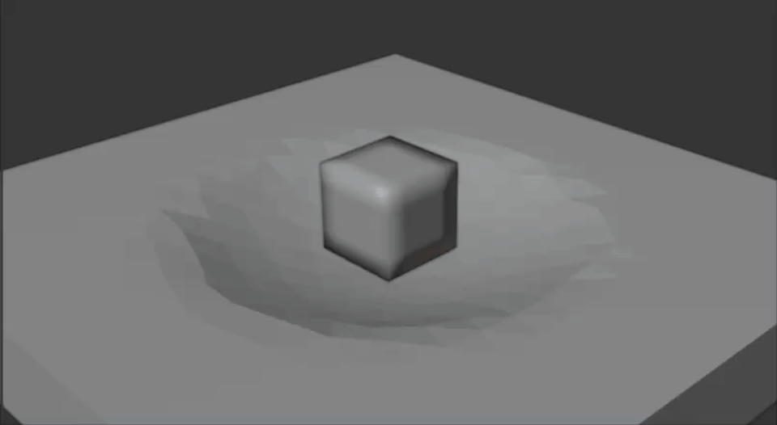

# libpgo: Library for Physically based Simulation (P), Geometric Shape Modeling (G), and Optimization (O)

[](https://github.com/annajcy/libpgo/actions/workflows/ci-cd.yml)
[](https://github.com/annajcy/libpgo/actions/workflows/docs.yml)
[](https://annajcy.github.io/libpgo/)

The library is designed to primarily focus on physically based simulations, geometric shape modeling, and optimization.
The source code extends [VegaFEM](https://viterbi-web.usc.edu/~jbarbic/vega/) and is designed for academic research purposes.

**Documentation:** [https://annajcy.github.io/libpgo/](https://annajcy.github.io/libpgo/)

---

## Prerequisites

1. **Conan 2.x**  
   libpgo now uses Conan as the only C++ dependency manager for both C++ and Python builds.

   ```bash
   pip install conan
   conan profile detect
   ```

2. **uv**  
   Python builds and local development use `uv` end-to-end.

   ```bash
   pip install uv
   ```

3. **Compilers**
   - **GCC 11-13** (Ubuntu)
   - **Apple Clang >= 15** (macOS)
   - **Visual Studio 2022** (Windows)

The repository ships private Conan recipes under `conan/recipes/`. They are exported
automatically during configure, so you do not need to run a separate recipe bootstrap step.

---

## Feature Model

The build now uses feature-oriented options instead of the old mixed entry-point flags.

### CMake Options

| Option | Default | Description |
|---|---|---|
| `PGO_FEATURE_PYTHON` | `OFF` | Build Python bindings |
| `PGO_FEATURE_ANIMATION_IO` | `OFF` | Enable Alembic/Imath animation I/O |
| `PGO_FEATURE_GEOMETRY_STACK` | `OFF` | Enable Boost/CGAL/Ceres/NLopt/SuiteSparse |
| `PGO_FEATURE_LIBIGL` | `OFF` | Enable libigl integration |
| `PGO_FEATURE_GEOGRAM` | `OFF` | Enable geogram integration |
| `PGO_FEATURE_GMSH` | `OFF` | Enable gmsh integration |
| `PGO_FEATURE_MKL` | `OFF` | Enable MKL support |
| `PGO_FEATURE_ARPACK` | `OFF` | Enable ARPACK support |
| `PGO_PROFILE_FULL` | `OFF` | Convenience profile that enables Python, animation I/O, geometry stack, libigl, geogram, and gmsh |

Behavior:
- `PGO_FEATURE_PYTHON=ON` implies `PGO_FEATURE_GEOMETRY_STACK=ON`
- `PGO_FEATURE_ANIMATION_IO=ON` is independent from Python
- `PGO_PROFILE_FULL=ON` expands to the full feature set

### Conan Options

The Conan options mirror the same feature model:

- `with_python`
- `with_animation_io`
- `with_geometry_stack`
- `with_libigl`
- `with_geogram`
- `with_gmsh`
- `with_mkl`
- `with_arpack`
- `profile_full`

---

## Compilation (C++ Library)

Use the checked-in CMake presets. They run through the required
`cmake/BootstrapConan.cmake` workflow, which exports local recipes, runs
`conan install`, and configures the project in one step.

### When Conan Runs Again

Conan is checked during the `cmake --preset ...` configure step, not during
`cmake --build`.

- The first configure of a preset runs `conan install`.
- Switching to a preset with a different feature/profile combination runs
  `conan install` again.
- Re-running configure for the same preset usually does not rerun Conan.

`BootstrapConan.cmake` stores a feature signature under the preset's build
directory and compares it against the current configuration. If the signature
changes, Conan is rerun automatically.

### Core Build

```bash
cd libpgo
cmake --preset core-release
cmake --build --preset core-release
ctest --preset core-release
```

### Geometry Stack Build

```bash
cd libpgo
cmake --preset geometry-release
cmake --build --preset geometry-release
ctest --preset geometry-release
```

### Animation I/O Without Python

```bash
cd libpgo
cmake --preset animation-release
cmake --build --preset animation-release
```

### Full Build

```bash
cd libpgo
cmake --preset full-release
cmake --build --preset full-release
ctest --preset full-release
```

### MKL Support

MKL is still system-managed rather than Conan-managed. Install it separately via Intel oneAPI or Conda,
then enable `PGO_FEATURE_MKL=ON` or `-o with_mkl=True`.

On Linux, run `source /opt/intel/oneapi/setvars.sh` before configure.  
On Windows, run `setvars.bat` from the oneAPI install directory.

---

## Compilation (Python Extension)

Python packaging now uses **`uv` + `pyproject.toml` + `scikit-build-core` + `CMake`**.
`setup.py` and `pip install .` are no longer part of the supported workflow.

### One-Step Editable Build

```bash
cd libpgo
uv sync
```

This will:
- create or update `.venv`
- install Python dependencies
- configure CMake through `scikit-build-core`
- run the required Conan dependency bootstrap during configure
- build the `pypgo` extension in editable mode

If you want a CMake-only Python binding build without animation export, use:

```bash
cd libpgo
cmake --preset python-minimal-release
cmake --build --preset python-minimal-release
```

### Run Python Code

```bash
uv run python -c "import pypgo; print(pypgo.__version__)"
uv run python src/api/python/pypgo/pgo_test_01.py
```

### Run Python Tests

```bash
uv run pytest
```

### Build Distributable Wheels

```bash
uv build
```

Artifacts are written to `dist/`.

### Fast C++ to Python Dev Loop

For day-to-day iteration:

```bash
cd libpgo
uv sync
uv run pytest
```

`scikit-build-core` reuses the build tree under `build/scikit-build`, so repeated `uv sync`
benefits from Ninja and CMake incremental rebuilds.

---

## Usage

We provide three python scripts to test the installation.

1. `pgo_test_01.py`. It runs a few basic pgo APIs.

    ```bash
    cd libpgo
    uv run python src/api/python/pypgo/pgo_test_01.py
    ```

    The expected result will look like

    ```text
    Opening file torus.veg.
    #vtx:564
    #tets:1950
    164,134,506,563
    L Info:
    10067040
    (10067040,)
    (10067040,)
    125.0
    GTLTLG Info:
    503400
    (503400,)
    (503400,)
    9695578.0
    [[  6.958279    0.          0.        -17.495821    0.          0.
       13.10052     0.          0.         -2.5629783   0.          0.       ]
     [  0.          6.958279    0.          0.        -17.495821    0.
        0.         13.10052     0.          0.         -2.5629783   0.       ]
     [  0.          0.          6.958279    0.          0.        -17.495821
        0.          0.         13.10052     0.          0.         -2.5629783]
     [ -5.1109824   0.          0.         10.111505    0.          0.
        8.160282    0.          0.        -13.160804    0.          0.       ]
     [  0.         -5.1109824   0.          0.         10.111505    0.
        0.          8.160282    0.          0.        -13.160804    0.       ]
     [  0.          0.         -5.1109824   0.          0.         10.111505
        0.          0.          8.160282    0.          0.        -13.160804 ]
     [ 23.97409     0.          0.         -6.634346    0.          0.
       -1.4866991   0.          0.        -15.853046    0.          0.       ]
     [  0.         23.97409     0.          0.         -6.634346    0.
        0.         -1.4866991   0.          0.        -15.853046    0.       ]
     [  0.          0.         23.97409     0.          0.         -6.634346
        0.          0.         -1.4866991   0.          0.        -15.853046 ]]
    ```

2. `pgo_run_sim.py`. It reads input config file and run simulation. You can try `box`, `box-with-sphere`, `dragon`, and `dragon-dyn` to test different simulation results. Take the box example for illustration.

    ```bash
    cd libpgo
    uv run python src/api/python/pypgo/pgo_run_sim.py examples/box/box.json
    ```

    If you want stricter run-to-run reproducibility, add `"deterministic": true` to the simulation JSON config.
    The Python API now supports explicit override as well:

    ```python
    import pypgo
    pypgo.run_sim_from_config("examples/box/box.json", deterministic=True)
    ```

    The Python wrapper script also supports this override:

    ```bash
    uv run python src/api/python/pypgo/pgo_run_sim.py examples/box/box.json --deterministic
    ```

    To save run stdout and stderr to a log file next to the config (`.json` -> `.log`):

    ```bash
    uv run python src/api/python/pypgo/pgo_run_sim.py examples/box/box.json --save-log
    ```

    For example, this writes `examples/box/box.log` and captures both streams.

    The native `runSim` tool also supports `--deterministic` and `--save-log`:

    ```bash
    <build-dir>/bin/runSim examples/box/box.json --save-log
    ```

    This uses the same log naming rule and writes `examples/box/box.log`.

    The expected result will look like the first image. The time integrator is hard-coded as implicit backward Euler (BE). You are free to change it to implicit Newmark (NW) or TR-BDF2 integrator (not support friction).
    <table style="width: 100%; table-layout: fixed; border-collapse: collapse;">
        <tr>
            <th style="width: 50%;text-align:center; border-top: 1px solid #ddd;">Box (NM)</th>
            <th style="width: 50%;text-align:center; border-top: 1px solid #ddd;">Box with Sphere (NM)</th>
        </tr>
        <tr>
            <td style="text-align: center; border-bottom: 1px solid #ddd;"></td>
            <td style="text-align: center; border-bottom: 1px solid #ddd;"></td>
        </tr>
        <tr>
            <th style="width: 50%;text-align:center;">Dragon (BE)</th>
            <th style="width: 50%;text-align:center;">Bunny (BE)</th>
        </tr>
        <tr>
            <td style="text-align: center; border-bottom: 1px solid #ddd;"></td>
            <td style="text-align: center; border-bottom: 1px solid #ddd;"></td>
        </tr>
        <tr>
            <th style="width: 50%;text-align:center;">Rest Dragon</th>
            <th style="width: 50%;text-align:center;">Deformed Dragon</th>
        </tr>
        <tr>
            <td style="text-align: center; border-bottom: 1px solid #ddd;"></td>
            <td style="text-align: center; border-bottom: 1px solid #ddd;"></td>
        </tr>
    </table>

3. `pgo_dump_abc.py`. It creates the abc file that can be used for blender/maya from config file `anim.json`. Essentially, it takes the simulation output `.obj` sequences and output a `.abc` file.

    ```bash
    cd libpgo
    uv run python src/api/python/pypgo/pgo_dump_abc.py examples/box/anim.json examples/box
    ```

4. `cubicMesher`. It creates a cubic/hexahedral volumetric mesh (`.veg`) from a uniform grid and can optionally export a triangulated surface mesh (`.obj`).

    Build the tool:

    ```bash
    cd libpgo
    cmake --build build --target cubicMesher
    ```

    Check CLI help:

    ```bash
    cd libpgo
    build/bin/cubicMesher uniform --help
    ```

    Generate a minimal cubic-box test asset (4×4×4):

    ```bash
    cd libpgo
    mkdir -p examples/cubic-box
    build/bin/cubicMesher uniform \
      --resolution 4 \
      --output-mesh examples/cubic-box/cubic-box.veg \
      --output-surface examples/cubic-box/cubic-box.obj \
      --E 1e6 --nu 0.45 --density 1000
    ```

    Quick sanity check:
    - For resolution `N`, generated volumetric mesh size should be `(N+1)^3` vertices and `N^3` cubic elements.
    - For `N=2`, it should produce `27` vertices and `8` elements.

## Update: Run with cubic mesh

libpgo now supports simulation configs driven by cubic/hexahedral volumetric meshes.
You can use the built-in example at `examples/cubic-box/cubic-box.json`, which uses
the `"cubic-mesh"` field as the simulation mesh input.

Command-line workflow for the cubic example:

```bash
cd libpgo

# 1) Ensure Python extension is built and importable
uv sync

# 2) Run cubic-mesh simulation (writes OBJ sequence to ret-cubic-box/)
uv run python src/api/python/pypgo/pgo_run_sim.py examples/cubic-box/cubic-box.json

# 3) Convert OBJ sequence to Alembic animation
uv run python src/api/python/pypgo/pgo_dump_abc.py examples/cubic-box/anim.json examples/cubic-box
```

Expected outputs:
- `examples/cubic-box/ret-cubic-box/ret0001.obj` ... `ret0199.obj`
- `examples/cubic-box/cubic-box.abc`

Preview (first 6 seconds):



---

## Third-party libraries

This library use the following third-party libraries:<br>
alembic, argparse, autodiff, boost, ceres, cgal, fmt, geogram, gmesh, json, knitro, libigl, mkl, pybind11, spdlog, suitesparse, tbb, tinyobj-loader

---

## Licence

This library is developed using [VegaFEM](https://viterbi-web.usc.edu/~jbarbic/vega/) along with various third-party libraries, each governed by their respective licenses. Detailed copyright and license information is included within the majority of the source files.

In instances where specific licensing details are not provided within a source file, the copyright remains with the author. The licensing for those source files adhere to the principles of the pre-existing license framework. For instance, if a source file without licensing details incorporates components that fall under the GPL parts of CGAL, then that file will adhere to the GPL. All other source files default to the MIT License unless stated otherwise.

---

## TODO

- [x] Functional and compilable on three major platforms.
- [ ] Documentation
- [ ] More python interface
- [ ] Cleanup source code with non-MIT/non-FreeBSD licence.
- [ ] GUI
