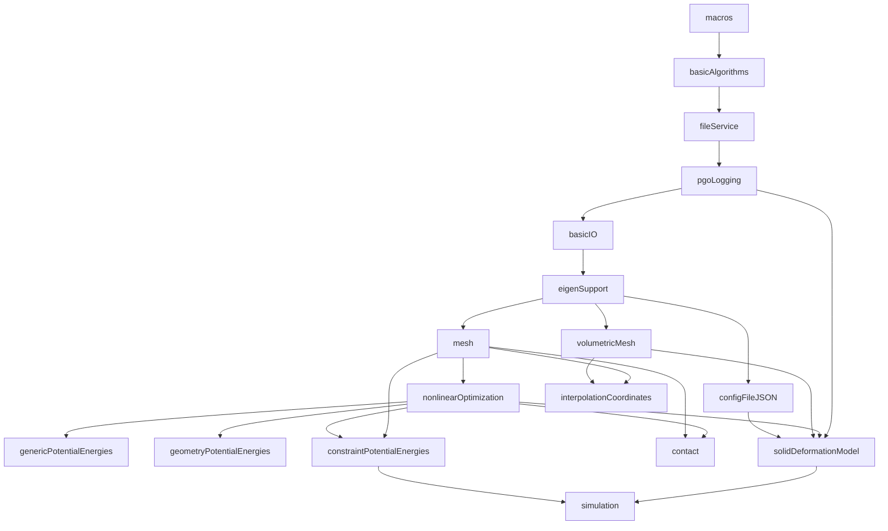

# libpgo 高层重构计划

## 1. 仓库概览

| 属性 | 值 |
|-----------|-------|
| **语言标准** | C++20（CMake `CMAKE_CXX_STANDARD 20`） |
| **构建系统** | CMake 3.28+，Conan 管理外部依赖 |
| **目标平台** | Linux（GCC）、macOS（AppleClang）、Windows（MSVC） |
| **规模** | 约 200 个源文件/头文件，分布在约 25 个模块中 |
| **来源** | 从 Vega FEM Simulation Library v4.0 fork 而来 |
| **格式化工具** | `.clang-format`（基于 Google 风格，4 空格缩进，120 列） |

**目录结构：**

```
libpgo/
├── src/
│   ├── api/                        # 面向用户的 API 层
│   │   ├── runSimCore.h/cpp        # 主仿真入口
│   │   ├── c/                      # C 绑定（pgo_c.h/cpp）
│   │   └── python/                 # Python 绑定（pybind11）
│   │
│   ├── core/                       # 核心仿真库
│   │   ├── energy/
│   │   │   ├── solidDeformationModel/    # 材料模型与形变
│   │   │   ├── genericPotentialEnergies/ # 二次/线性能量
│   │   │   ├── geometryPotentialEnergies/# 基于几何的能量
│   │   │   └── constraintPotentialEnergies/ # 约束能量
│   │   │
│   │   ├── solve/
│   │   │   ├── nonlinearOptimization/    # Newton、IPOPT、Knitro
│   │   │   ├── contact/                  # CCD、自接触、穿透处理
│   │   │   └── simulation/               # 时间积分器
│   │   │
│   │   ├── scene/
│   │   │   ├── volumetricMesh/           # 四面体/立方体网格与材料
│   │   │   ├── mesh/                     # TriMesh、TetMeshGeo、BVH
│   │   │   └── interpolationCoordinates/ # Barycentric、Green、MeanValue
│   │   │
│   │   ├── utils/                        # 日志、IO、算法、宏
│   │   └── external/                     # Eigen、CGAL、Geogram 封装
│   │
│   └── tools/                      # CLI 可执行工具
│       ├── runSim/                  # 仿真运行器
│       ├── tetMesher/              # 四面体网格生成
│       ├── cubicMesher/            # 立方网格生成
│       ├── remeshSurface/          # 表面重网格化
│       └── animation/              # 动画转换
│
├── tests/                          # 测试套件
├── conan/                          # 第三方依赖的 Conan 配方
├── docs/                           # MkDocs 文档
└── examples/                       # 示例配置
```

---

## 2. 模块地图

### 2.1 核心库（构建顺序）

| 模块 | 命名空间 | 职责 | 公共 API 面 |
|--------|-----------|---------------|-------------------|
| **macros** | `pgo::Macros` | SIMD 矩阵操作、tuple 辅助工具 | 预处理宏、内联数学工具 |
| **basicAlgorithms** | `pgo::BasicAlgorithms` | 容器（vector stack、heap）、图算法、k-means | 数据结构工具 |
| **fileService** | `pgo::FileService` | 路径处理、文件发现 | `FileService` 类 |
| **pgoLogging** | `pgo::Logging` | 基于 fmt 且支持 Eigen 的日志系统 | 日志宏/函数 |
| **basicIO** | `pgo::BasicIO` | 文件读写工具 | I/O 自由函数 |
| **eigenSupport** | `pgo::EigenSupport` | Eigen3 类型别名、稀疏矩阵类型 | 类型定义（V3d、MXd、SpMatD） |
| **configFileJSON** | `pgo::ConfigFileJSON` | JSON 配置解析 | 配置读取类 |
| **mesh** | `pgo::Mesh` | TriMeshGeo、TetMeshGeo、BVH、几何查询 | 网格几何类型、空间查询 |
| **nonlinearOptimization** | `pgo::NonlinearOptimization` | 能量/约束抽象、求解器 | `PotentialEnergy`、`ConstraintFunction`、`NonlinearProblem`、各类求解器 |
| **genericPotentialEnergies** | `pgo::NonlinearOptimization` | 二次/线性/Laplacian 能量 | 具体 `PotentialEnergy` 子类 |
| **geometryPotentialEnergies** | `pgo::NonlinearOptimization` | 几何驱动能量 | 具体 `PotentialEnergy` 子类 |
| **constraintPotentialEnergies** | `pgo::ConstraintPotentialEnergies` | 软约束、滑动、刚体运动 | `PotentialEnergyAligningMeshConnectivity` 子类 |
| **contact** | `pgo::Contact` | CCD、自接触、穿透能量 | 接触处理器、CCDKernel |
| **volumetricMesh** | `pgo::VolumetricMeshes` | 四面体/立方体体网格与材料 | `VolumetricMesh`、`TetMesh`、`CubicMesh` |
| **interpolationCoordinates** | `pgo::InterpolationCoordinates` | 形变嵌入坐标 | `InterpolationCoordinatesBase` 子类 |
| **solidDeformationModel** | `pgo::SolidDeformationModel` | 弹塑性材料模型、仿真网格 | `DeformationModel`、`SimulationMesh`、`DeformationModelManager` |
| **simulation** | `pgo::Simulation` | 时间积分（backward Euler、TRBDF2） | `TimeIntegrator` 子类 |

### 2.2 API 层

| 模块 | 职责 |
|--------|---------------|
| **simulationApi** | 高层仿真运行入口（`runSimFromConfig`） |
| **pgo_c** | 面向 FFI 使用者的 C 链接绑定 |
| **pypgo** | 基于 pybind11 的 Python 绑定 |

### 2.3 外部封装

| 模块 | 封装对象 |
|--------|-------|
| **eigenSupport** | Eigen3 类型与工具 |
| **cgalInterface** | CGAL 几何算法 |
| **geogramInterface** | Geogram 网格操作 |
| **libiglInterface** | libigl 函数 |
| **tetgenInterface** | TetGen 网格生成 |

---

## 3. 依赖分析

### 3.1 依赖图



### 3.2 循环依赖

**未发现循环依赖。** 当前构建顺序严格线性，这一点是健康的。

### 3.3 耦合问题

1. **`solidDeformationModel` 是依赖汇聚点**：它同时拉入 volumetricMesh、nonlinearOptimization、configFileJSON、pgoLogging、Eigen3、TBB 和 fmt。上游模块的任何变动都会在这里级联放大。

2. **`simulationApi` 几乎依赖所有内容**：它链接了 13 个库。作为顶层编排模块这在一定程度上合理，但也让 API 层对内部实现变化非常脆弱。

3. **`VolumetricMesh` 与 `SimulationMesh` 存在重复抽象**：两者都表示带材料的体网格，但采用不同的数据模型。`SimulationMesh` 是后续引入的更干净抽象，而老的 `VolumetricMesh` 体系仍主导代码库。这种双网格并存导致了额外桥接代码（新的 `sceneToSimulationMesh.h/cpp`）。

4. **`VolumetricMesh` 中的 friend 函数造成紧耦合**：`editing::subset_in_place` 和 `editing::remove_isolated_vertices` 被声明为 `VolumetricMesh` 的 friend，这让编辑模块与内部数据布局强绑定。

---

## 4. 架构问题

### 4.1 上帝类：`VolumetricMesh`

**问题：** `VolumetricMesh`（头文件约 390 行）同时承担了以下职责：
- 网格几何存储与访问
- 材料管理（materials、sets、regions）
- 几何查询（最近单元、包含单元、bounding box）
- 插值（barycentric weights、gradient interpolation）
- 重力计算
- 形变应用
- 边查询
- 惯性张量计算
- 质量计算
- 顶点体积计算

**影响：** 这些职责中的任一部分发生变化，都会触发所有包含 `volumetricMesh.h` 的代码重新编译。这个类对单一职责原则的违反非常严重。

**当前缓解进展：** 新文件（`volumetricMeshIO.h`、`volumetricMeshEdit.h`、`volumetricMeshExport.h`、`volumetricMeshInterpolation.h`、`volumetricMeshTypes.h`）已经开始把部分职责拆成子命名空间下的自由函数。这是正确方向。

### 4.2 双网格抽象问题

**问题：** `VolumetricMesh`（scene 层）和 `SimulationMesh`（energy 层）都在表示带材料的体网格，但接口彼此不兼容：

| 维度 | VolumetricMesh | SimulationMesh |
|--------|---------------|----------------|
| 单元访问 | `getVertexIndex(el, j)` | `getVertexIndex(ele, j)` |
| 顶点访问 | 返回 `Vec3d&` | 写入 `double[3]` |
| 材料 | `Material*` 层次（ENu、Ortho、MR） | `SimulationMeshMaterial*`（独立层次） |
| 单元类型 | `ElementType::Tet`、`Cubic` | `SimulationMeshType::TET`、`CUBIC`、`TRIANGLE`、`EDGE_QUAD`、`SHELL` |
| 所有权模型 | 基于继承的类层次 | 基于 `std::unique_ptr` 的工厂 |

`sceneToSimulationMesh` 这层桥接本质上就是这种重复抽象的症状。

### 4.3 内存管理反模式

**`DeformationModel` 手工缓存分配：**
```cpp
virtual CacheData* allocateCacheData() const = 0;     // raw new
virtual void freeCacheData(CacheData* data) const = 0; // raw delete
```
这是典型的 C++98 模式。调用方必须记得成对调用 allocate/free，否则就会泄漏。

**`DeformationModel` 中的原始指针成员：**
```cpp
ElasticModel* em;   // 非拥有？空析构函数暗示可能泄漏
PlasticModel* pm;
```
所有权语义不清晰。虚析构函数 `~DeformationModel() {}` 为空，并不会删除 `em` 或 `pm`。

**`DeformationModelManager` 的 PIMPL 使用原始指针：**
```cpp
DeformationModelManagerImpl* data;  // 应该改成 unique_ptr
```

### 4.4 错误处理不一致

代码库混用了三种错误报告策略，但没有统一策略：
1. **返回码：** `volumetricMeshIO` 返回 `int`（0 表示成功）
2. **哨兵值：** `getContainingElement()` 失败时返回 `-1`
3. **静默 no-op：** `PotentialEnergy::hessianVector()` 静默不执行任何操作
4. **异常：** 某些构造函数中会抛异常（但没有文档说明）

### 4.5 `VolumetricMesh` 中的原始指针 API

很多函数要求调用方预先分配裸缓冲区：
```cpp
void getElementVertices(int element, Vec3d* elementVertices) const;
void getElementEdges(int el, int* edgeBuffer) const;
void computeBarycentricWeights(int element, const Vec3d& pos, double* weights) const;
void computeElementMassMatrix(int element, double* massMatrix) const;
void getVertexVolumes(double* vertexVolumes) const;
void computeGravity(double* gravityForce, double g = 9.81, bool addForce = false) const;
```
这种接口容易造成缓冲区越界，也无法在类型系统里表达期望尺寸。

### 4.6 `DeformationModel` 的原始 `double*` API

所有能量计算都依赖裸 `double*` 缓冲区：
```cpp
virtual void prepareData(const double* x, const double* param, const double* materialParam, CacheData*) const = 0;
virtual void compute_dE_dx(const CacheData*, double* grad) const = 0;
virtual void compute_d2E_dx2(const CacheData*, double* hess) const = 0;
```
既没有尺寸信息，也没有类型安全保障，很容易传错缓冲区大小。

---

## 5. 现代 C++ 改进机会

### 5.1 智能指针

| 位置 | 当前做法 | 建议做法 | 工作量 |
|----------|---------|-------------|--------|
| `DeformationModel::allocateCacheData()` | 返回原始 `CacheData*` | 返回 `std::unique_ptr<CacheData>` | `[M]` |
| `DeformationModel::em`、`pm` | 原始 `ElasticModel*`、`PlasticModel*` | 改为 `std::unique_ptr`，或至少明确注明非拥有语义 | `[S]` |
| `DeformationModelManager::data` | 原始 `Impl*` | 改为 `std::unique_ptr<Impl>` | `[S]` |
| `VolumetricMesh::setMaterial(int, const Material*)` | 原始指针参数 | 改为 `std::unique_ptr<Material>` 或 `const Material&` | `[M]` |

### 5.2 用 `std::span` 替代缓冲区参数

用 `std::span` 取代原始指针加隐式长度：

```cpp
// 修改前:
void getElementVertices(int element, Vec3d* elementVertices) const;
void computeGravity(double* gravityForce, double g, bool addForce) const;

// 修改后:
void getElementVertices(int element, std::span<Vec3d> elementVertices) const;
void computeGravity(std::span<double> gravityForce, double g, bool addForce) const;
```

代码库在新代码中已经使用 `std::span`（例如 `SimulationMesh` 的工厂方法、`VolumetricMesh` 的构造函数）。这应继续扩展到剩余的原始指针 API。

### 5.3 `enum class` 一致性

较新的代码已经正确使用 `enum class`（`ElementType`、`FileFormatType`、`SimulationMeshType`、`MaterialType`）。`DeformationModelElasticMaterial` 和 `DeformationModelPlasticMaterial` 也同样是 `enum class`。这一点整体一致，**无需修改**。

### 5.4 `std::optional` 与 `std::expected`

| 函数 | 当前返回值 | 更合适的返回值 |
|----------|---------------|---------------|
| `getContainingElement(Vec3d)` | 失败时返回 `-1` | `std::optional<int>` |
| `volumetricMeshIO::save()` | `int` 错误码 | `std::expected<void, std::string>` 或异常 |
| `volumetricMeshIO::load_*()` | `int` 错误码 | `std::expected<LoadedMeshData, std::string>` |

### 5.5 `constexpr` 与 `consteval`

- `VolumetricMesh::E_default`、`nu_default`、`density_default` 已经是 `constexpr static`，这点很好。
- 材料属性枚举中的 `Count` 值可以考虑改成 `constexpr` 函数来表达。

### 5.6 Concepts（C++20）

`PotentialEnergy` 和 `ConstraintFunction` 抽象类定义了纯虚接口。对于性能敏感的内部循环，可以考虑引入带 concept 约束的模板：

```cpp
template <typename E>
concept EnergyModel = requires(const E& e, EigenSupport::ConstRefVecXd x) {
    { e.func(x) } -> std::convertible_to<double>;
    { e.getNumDOFs() } -> std::convertible_to<int>;
};
```

**但要注意：** 当前基于虚派发的设计非常适合能量系统的多态特性，因为这里通常需要在运行时组合多种 energy 类型。只有在 energy 类型可于编译期确定的场景，concept 才真正有收益。**不要强行推广，只在确实能带来收益的局部使用。**

### 5.7 去除 C 风格遗留

- `volumetricMesh.h` 包含了 `<cstdio>`，但头文件中并未使用，应删除
- `TimeIntegrator::setSolverConfigFile(const char*)` 应改为使用 `std::filesystem::path`
- 散落各处的 `int verbose` 参数可以改成 `enum class Verbosity`

---

## 6. 模板元编程与现代范式

### 6.1 CRTP 机会：`DeformationModel` 的缓存模式

`allocateCacheData()` / `freeCacheData()` 这一模式非常适合改造成 CRTP：

```cpp
template <typename Derived, typename Cache>
class DeformationModelBase : public DeformationModel {
public:
    std::unique_ptr<CacheData> allocateCacheData() const override {
        return std::make_unique<Cache>();
    }
    // 不再需要 freeCacheData，交给 unique_ptr 处理即可
};
```

每个具体的形变模型（TetMesh、Koiter 等）都可以继承自 `DeformationModelBase<ConcreteModel, ConcreteCache>`。这样可以彻底消除手工分配模式。

**复杂度：** `[M]`，需要更新约 10 个 `DeformationModel` 子类。  
**风险：** `[med-risk]`，因为这会改动虚接口。

### 6.2 策略式设计：求解器配置

`TimeIntegrator` 具备多种可配置行为：
- 阻尼模型（Rayleigh、自定义）
- 约束处理（penalty、augmented Lagrangian）
- 线搜索策略

这些理论上可以变成策略模板参数，但当前通过 `setSolverConfigFile` 在运行时配置，更符合这个领域的实际需求（用户通过 JSON 在运行时配置）。因此这里**不建议**改成 policy-based design，运行时配置的灵活性比编译期派发的收益更重要。

### 6.3 用 `std::variant` 表达材料类型

`VolumetricMesh::Material` 层次（ENu、Orthotropic、MooneyRivlin）是一个封闭的 3 类型集合，这其实很适合 `std::variant`：

```cpp
using MaterialParams = std::variant<ENuParams, OrthotropicParams, MooneyRivlinParams>;

struct Material {
    std::string name;
    double density;
    MaterialParams params;
};
```

**收益：** 无需虚派发、无需为材料做堆分配、序列化更简单。  
**风险：** `[high-risk]`，因为这部分已经深度嵌入 `VolumetricMesh`，材料指针在各处都有暴露。  
**建议：** 可以作为未来阶段的候选方案；当前方案虽然老，但仍可理解且可维护。

---

## 7. 重构优先级矩阵

优先级按“影响力 × 可实施性”排序，优先级越高越应先做。

### 阶段 1：高影响、低风险（机械式改动）

| # | 重构项 | 工作量 | 风险 | 影响 | 依赖 |
|---|------------|--------|------|--------|-----------|
| 1 | **完成 `VolumetricMesh` 的拆解**：把 IO、编辑、导出、插值继续拆成自由函数（目前已开始） | `[M]` | `[low-risk]` | HIGH | -- |
| 2 | **将 `DeformationModelManager::data` 从原始指针改为 `std::unique_ptr`** | `[S]` | `[low-risk]` | MED | -- |
| 3 | **将 `DeformationModel::allocateCacheData/freeCacheData` 改为返回 `std::unique_ptr`** | `[M]` | `[med-risk]` | HIGH | -- |
| 4 | **删除 `volumetricMesh.h` 中未使用的 `#include <cstdio>`** | `[S]` | `[low-risk]` | LOW | -- |
| 5 | **为 `CubicMesh` 所有虚函数补齐 `override`** | `[S]` | `[low-risk]` | LOW | -- |

### 阶段 2：中等影响、中等风险（API 改进）

| # | 重构项 | 工作量 | 风险 | 影响 | 依赖 |
|---|------------|--------|------|--------|-----------|
| 6 | **把 `VolumetricMesh` 中的原始 `double*` 缓冲区参数改为 `std::span`** | `[M]` | `[med-risk]` | MED | 阶段 1.1 |
| 7 | **明确 `DeformationModel` 对 `em`/`pm` 的所有权**：要么改为 `std::unique_ptr`，要么明确标注为非拥有并补断言 | `[S]` | `[med-risk]` | MED | -- |
| 8 | **统一错误处理策略**：构造失败使用异常，查询接口使用 `std::optional` / `std::expected` | `[L]` | `[med-risk]` | MED | -- |
| 9 | **全局将 `const char*` 参数替换为 `std::string_view` 或 `std::filesystem::path`** | `[M]` | `[low-risk]` | LOW | -- |
| 10 | **统一命名约定**：新的自由函数使用 snake_case，旧成员函数仍是 camelCase。应在 CLAUDE.md 中明确说明这种过渡状态 | `[S]` | `[low-risk]` | LOW | -- |

### 阶段 3：高影响、高风险（结构性改动）

| # | 重构项 | 工作量 | 风险 | 影响 | 依赖 |
|---|------------|--------|------|--------|-----------|
| 11 | **整合 `VolumetricMesh` / `SimulationMesh`**：清晰划分边界，前者负责 scene/IO，后者负责计算，并移除重叠部分 | `[L]` | `[high-risk]` | HIGH | 阶段 1.1、2.6 |
| 12 | **将 `DeformationModel` 的缓存模式改为 CRTP**：在所有子类中消除手工 allocate/free | `[M]` | `[med-risk]` | MED | 阶段 1.3 |
| 13 | **将 `DeformationModel` 中原始 `double*` 梯度/Hessian API 改为 Eigen 类型** | `[L]` | `[high-risk]` | HIGH | 阶段 2.6 |

### 阶段 4：长期项（可选现代化）

| # | 重构项 | 工作量 | 风险 | 影响 | 依赖 |
|---|------------|--------|------|--------|-----------|
| 14 | **用 `std::variant` 表达 Material 类型**：以 variant 取代 Material 类层次 | `[L]` | `[high-risk]` | MED | 阶段 3.11 |
| 15 | **为 energy/constraint 接口补充 concepts**：在模板代码中增加 concept 约束 | `[M]` | `[low-risk]` | LOW | -- |
| 16 | **为 `TimeIntegrator` 引入 PIMPL**：隐藏实现细节，降低头文件耦合 | `[M]` | `[med-risk]` | MED | -- |

---

## 8. 编码风格缺口

### 8.1 目标风格摘要

`.clang-format` 使用的是 Google 风格变体：4 空格缩进、120 列限制、K&R（Attach）大括号、指针左对齐。这部分可以通过格式化工具自动保证。

### 8.2 命名规范审计

代码库存在一种**双轨命名规范**，而且看起来是有意为之：

| 元素 | 当前使用规范 | 目标规范 | 状态 |
|---------|----------------|-------------------|--------|
| 类 | PascalCase（`VolumetricMesh`、`TetMesh`） | PascalCase | 符合 |
| 成员函数 | camelCase（`getNumVertices`、`getElementType`） | snake_case | 不符合 |
| 自由函数（新代码） | snake_case（`save_to_ascii`、`subset_in_place`） | snake_case | 符合 |
| 成员变量 | 混用（`numVertices`、`em`、`pm`） | `m_` 前缀 | 不符合 |
| 私有成员（新代码） | 尾随下划线（`vertices_`、`elements_`） | `m_` 前缀 | 不符合 |
| 常量 | `constexpr static` + camelCase（`E_default`） | `k` 前缀 PascalCase（`kEDefault`） | 不符合 |
| 枚举 | `enum class` + PascalCase 枚举值 | PascalCase 枚举值 | 符合 |
| 文件 | camelCase（`volumetricMesh.h`、`tetMesh.h`） | snake_case（`.hpp`/`.cpp`） | 不符合 |

### 8.3 建议的规范收敛策略

考虑到代码库规模较大，且保留了明显的 Vega FEM 历史风格，全面重命名并不现实。更合理的策略是：

1. **新代码** 严格遵循目标规范（snake_case 函数、`m_` 前缀成员、snake_case 文件名，扩展名使用 `.hpp` / `.cpp`）
2. **旧代码** 在对应模块被重构时顺带迁移，不单独做全局重命名
3. **`SimulationMesh`** 目前已经使用尾随下划线（`vertices_`、`elements_`）；后续如果迁移，应统一改为 `m_` 前缀
4. **不要批量改文件名**；应按模块逐步处理，这样 git blame 仍然具有可读性

### 8.4 具体风格问题

- `volumetricMesh.h:246`：`Material` 构造函数按值接收 `std::string`，应改为 `const std::string&`，或保留按值但配合 `std::move`
- `volumetricMesh.h:364`：`Set::operator=` 没有使用 copy-and-swap 惯用法
- `potentialEnergy.h:40-41`：`isQuadratic()`、`hasHessianVector()`、`hasHessian()` 返回 `int`，更合理的是 `bool`
- `deformationModel.h:31-32`：空的虚函数体 `{}` 没有说明默认行为
- `volumetricMesh.h:184-185`：参数传递方式不一致（`Vec3d pos` 按值传递，而别处用 `const Vec3d&`）

---

## 9. 总结

这个代码库整体结构并不混乱，模块边界基本清晰，也没有检测到循环依赖。当前最主要的问题集中在以下五点：

1. **`VolumetricMesh` 是上帝类**（而且拆分工作已经开始，应该尽快收尾）
2. **双网格抽象并存**（`VolumetricMesh` 与 `SimulationMesh`，需要明确边界并逐步合并）
3. **`DeformationModel` 家族中仍存在原始指针内存管理**（allocate/free 模式、所有权不清）
4. **大量 C 风格缓冲区 API**（遍布代码的原始 `double*` 参数）
5. **命名规范在遗留代码与新代码之间不一致**

建议采用增量式策略推进：先完成正在进行中的 `VolumetricMesh` 拆分（阶段 1），再推进内存管理现代化（阶段 2），最后处理 `VolumetricMesh` / `SimulationMesh` 的结构性整合（阶段 3）。文件名和函数名的收敛应在每一阶段顺手完成，而不是另起一次大规模重命名。
