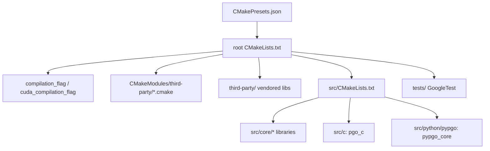
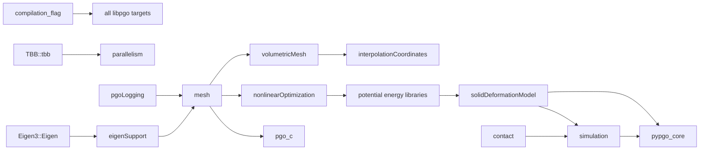

# libpgo CMake 体系梳理与整理计划

## 目标与边界

这份计划只整理 CMake 结构，不改变当前编译选项、默认选项、依赖版本、目标链接语义和 CI preset 行为。

硬约束：

- 不改 `PGO_*` 选项的默认值。
- 不改 `CMakePresets.json` 中现有 preset 的语义。
- 不改现有编译/链接 flag 的实际集合。
- 不把显式源文件列表替换成 `file(GLOB ...)`。
- 不重写 `FindBLAS.cmake` / `FindLAPACK.cmake`，先隔离，后评估。

## 当前体系地图

### 入口层

- `CMakePresets.json`
  - 定义构建画像：`base`、`pypgo`、`pypgo-ci`、`pypgo-mkl-ci`，以及 debug / CUDA / Knitro / Pardiso 组合 preset。
  - CI 主要使用 `pypgo-ci` / `pypgo-mkl-ci` 和 `base`。
- `CMakeLists.txt`
  - 当前承担了太多职责：
    - 项目级 option 声明。
    - macOS / conda / Windows 平台修补。
    - `compilation_flag` / `cuda_compilation_flag` / debug flag 目标构造。
    - 第三方依赖加载顺序。
    - `add_libpgo_lib` target helper。
    - `src`、`tests`、`projects` 入口。
    - 安装导出 `pgoConfig.cmake`。

### Helper 层

- `CMakeModules/CompilationUtils.cmake`
  - 提供 `add_flag`、`add_flag_poxis`、`add_flag_cuda`、`add_def`、`add_link_flag`、`fix_mkl_tbb_debug` 等。
  - 问题：C / CXX / CUDA、GNU / Clang / AppleClang / MSVC 分支重复很多。
- `CMakeModules/PgoDependencyHelpers.cmake`
  - 提供 `pgo_dep_option`、FetchContent 复用、兼容 `FetchContent_Populate`、patch 应用。
  - 这是目前比较好的抽象，应该继续作为第三方依赖层的公共底座。
- `CMakeModules/Find_AVX.cmake`
  - 做 AVX probe，结果供 MSVC `/arch:*` 选择使用。
  - 注意：它会设置 `CMAKE_REQUIRED_FLAGS`，这个模块和 `PGO_NATIVE_OPTIMIZATION` / CI 关系敏感，整理时只移动不改语义。

### 第三方依赖层

- `third-party/`
  - 仓库内 vendored 小依赖：`CCD`、`ASA`、`stb`、`tiny_obj_loader`、`tetgen`、MSVC GMP/MPFR shim、`imgui`。
- `CMakeModules/third-party/*.cmake`
  - FetchContent 或 find_package 入口。
  - 简单依赖：`fmt`、`spdlog`、`nlohmann_json`、`argparse`、`autodiff`、`nanobind` 等。
  - 复杂依赖：`cgal`、`geogram`、`ftetwild`、`gmsh`、`openvdb`、`suitesparse`、`mkl`、`boost`。
  - 判断：复杂依赖的杂乱多数是现实约束，不应先动；简单依赖的样板可以统一。

### 源码目标层

`src/CMakeLists.txt` 通过 `PGO_GLOBAL_LIBRARY_TARGETS` 固定顺序加入核心库：


```mermaid
flowchart TD
  presets["CMakePresets.json"] --> root["root CMakeLists.txt"]
  root --> flags["compilation_flag / cuda_compilation_flag"]
  root --> deps["CMakeModules/third-party/*.cmake"]
  root --> thirdparty["third-party/ vendored libs"]
  root --> src["src/CMakeLists.txt"]
  src --> core["src/core/* libraries"]
  src --> c_api["src/c: pgo_c"]
  src --> python["src/python/pypgo: pypgo_core"]
  root --> tests["tests/ GoogleTest"]
```

核心模块大致分层：

- 基础层：`macros`、`basicAlgorithms`、`profiling`、`pgoLogging`、`parallelism`、`basicIO`、`configFileJSON`、`eigenSupport`。
- 几何与网格层：`mesh`、`volumetricMesh`、`interpolationCoordinates`、`cgalInterface`、`geogramInterface`、`libiglInterface`、`tetgenInterface`、`volumetricMeshMeshing`、`implicitSurface`、`animationIO`。
- 优化与物理层：`nonlinearOptimization`、`genericPotentialEnergies`、`geometryPotentialEnergies`、`constraintPotentialEnergies`、`contact`、`solidDeformationModel`、`simulation`。
- 对外 API 层：`pgo_c`、`pypgo_core`。

### 当前依赖流


```mermaid
flowchart LR
  flags["compilation_flag"] --> all["all libpgo targets"]
  tbb["TBB::tbb"] --> parallelism
  eigen["Eigen3::Eigen"] --> eigenSupport
  logging["pgoLogging"] --> mesh
  eigenSupport --> mesh
  mesh --> volumetricMesh
  volumetricMesh --> interpolationCoordinates
  mesh --> nonlinearOptimization
  nonlinearOptimization --> potentials["potential energy libraries"]
  potentials --> solid["solidDeformationModel"]
  solid --> simulation
  contact --> simulation
  solid --> pypgo["pypgo_core"]
  simulation --> pypgo
  mesh --> c_api["pgo_c"]
```

## 主要问题

### 1. 根 `CMakeLists.txt` 是 God 文件

症状：

- option、平台修补、依赖加载、flag 构造、target helper、install 全混在一起。
- 调试 CI 时需要在一个 500+ 行文件里找实际入口。

影响：

- 不容易判断某段逻辑是“项目策略”还是“某个平台的补丁”。
- 新增依赖时容易继续往根文件堆。

### 2. Flag helper 重复且命名有历史包袱

症状：

- `add_flag` 对 C 和 CXX 各写一遍平台分支。
- `add_flag_cuda` 又写一遍类似逻辑。
- `add_flag_poxis` 拼写是历史遗留，读起来像 typo。

影响：

- 行为本身能用，但维护成本高。
- 后续加一个编译器或语言条件会继续复制。

### 3. 第三方依赖分两类，但现在混在同一平面

简单依赖只需要：

- 设置若干上游 option。
- `FetchContent_Declare`。
- `pgo_fetch_make_available`。

复杂依赖需要：

- patch fetched source。
- conda path pinning。
- Windows runtime/import lib 特判。
- alias target 修补。
- BLAS/LAPACK redirect。

问题不是文件多，而是简单和复杂看起来一样“重”。

### 4. 模块 CMakeLists 重复检查依赖

多数模块都在重复：

```cmake
foreach(tgt ${FOO_DEPS})
  if(NOT TARGET ${tgt})
    message(STATUS "foo is not included. Missing: ${tgt}")
    return()
  endif()
endforeach()
```

这个模式适合抽成一个 helper。保留“缺依赖就跳过模块”的行为，不改变语义。

### 5. `PGO_GLOBAL_LIBRARY_TARGETS` 同时承担两件事

它既是 `add_subdirectory(core/${lib})` 的构建顺序，又被 `pgo_c` 用来链接所有已存在库。

这能工作，但概念上混了：

- build order
- C API link surface

短期不改行为；长期可以拆成两个同内容列表，先让意图清楚。

### 6. Patch 逻辑分散

`geogram.cmake`、`ftetwild.cmake` 都有“读取文件、查找 snippet、替换 snippet、写回”的逻辑。

已有 `pgo_apply_patch`，但有些补丁是动态 string replacement，仍需要一个公共 `pgo_replace_in_file`。

### 7. 测试目标样板重复

GoogleTest 目标大多是：

- `add_executable`
- `target_link_libraries(... GTest::gtest_main ...)`
- `set_property(FOLDER)`
- `pgo_gtest_discover_tests`

适合抽一个 `pgo_add_gtest`，不改测试本身。

## 建议后的目录结构

第一阶段只新增/移动 CMake 组织文件，根入口保留同样 include 顺序：

```text
CMakeModules/
  PgoOptions.cmake          # option 声明
  PgoPlatform.cmake         # 平台修补、PGO_CHECK_CONDA 搜索路径、Python、BLAS hints
  PgoCompilerFlags.cmake    # compilation_flag/cuda_compilation_flag 构造
  PgoTargets.cmake          # add_libpgo_lib
  PgoThirdParty.cmake       # 第三方 include 顺序
  PgoTesting.cmake          # GoogleTest helper，可后置
  PgoDependencyHelpers.cmake
  CompilationUtils.cmake
  third-party/
```

根 `CMakeLists.txt` 最终应该只保留：

```cmake
cmake_minimum_required(...)
project(...)

include(CMakeModules/PgoOptions.cmake)
include(CMakeModules/PgoPlatform.cmake)
include(CMakeModules/CompilationUtils.cmake)
include(CMakeModules/PgoDependencyHelpers.cmake)
include(CMakeModules/PgoCompilerFlags.cmake)
include(CMakeModules/PgoThirdParty.cmake)
include(CMakeModules/PgoTargets.cmake)

add_subdirectory(src)
...
```

## 具体整理步骤

### Path / platform helper policy

- thin helper 只接受 common path shape，不接管包策略。
- 通用 environment path initialization 放在 platform/environment setup，例如 `PgoPlatform.cmake`。
- package-specific platform differences 留在各自 `CMakeModules/third-party/*.cmake`。
- 不把 package strategy 集中成一个 giant platform abstraction。
- 大约 3+ 处重复 path logic 后再抽 helper。
- third-party module 不改 global compiler flags；这些仍归 `PgoCompilerFlags.cmake`。

### Phase 0: 行为基线冻结

1. [S] [low-risk] 记录基线命令，不改代码：
   - `cmake --preset pypgo-ci`
   - `cmake --build --preset pypgo-ci --target pypgo_core`
   - `cmake --preset base`
   - Linux/Windows/macOS CI 至少各看一次 configure 结果。
2. [S] [low-risk] 在计划或 PR 描述里写明“不改编译选项”，避免后续顺手改 flag。

### Phase 1: 拆根文件，只搬不改

1. [S] [low-risk] 把 option 声明和 macOS `PGO_USE_MKL` / `PGO_ENABLE_CUDA` 强制关闭逻辑移动到 `PgoOptions.cmake`。
2. [S] [low-risk] 把 `PGO_CHECK_CONDA` 相关路径、`BLA_VENDOR`、`Python_EXECUTABLE`、macOS OpenBLAS symlink 逻辑移动到 `PgoPlatform.cmake`。
3. [M] [low-risk] 把 `compilation_flag`、`compilation_flag_for_debug`、`cuda_compilation_flag` 构造移动到 `PgoCompilerFlags.cmake`。函数调用和 flag 列表原样保留。
4. [S] [low-risk] 把 `add_libpgo_lib` 移动到 `PgoTargets.cmake`。
5. [S] [low-risk] 把第三方依赖 include 顺序移动到 `PgoThirdParty.cmake`。顺序原样保留。

验证：

- `git diff --word-diff` 确认被移动的 flag 文本没有变化。
- 每移动一块跑一次最轻 configure：`cmake --preset pypgo-ci`。

### Phase 2: 收掉明显重复 helper

1. [M] [med-risk] 在 `CompilationUtils.cmake` 内部增加一个私有 helper，例如 `_pgo_add_lang_option`，让 `add_flag` / `add_def` / `add_flag_cuda` 复用它。
   - 保留现有 public 函数名。
   - 保留 `add_flag_poxis`，额外增加拼写正确的 `add_flag_posix` alias。
2. [S] [low-risk] 增加 `pgo_require_targets(module TARGETS ...)`：
   - 只封装重复 missing-target 检查。
   - 仍然 `message(STATUS ...)` 后 `return()`，不改 optional module 行为。
3. [S] [low-risk] 增加 `pgo_replace_in_file(target_file old_text new_text)`，供 `geogram.cmake` 和 `ftetwild.cmake` 共用。

### Phase 3: 简化模块 CMakeLists

先挑最小模块，不碰 `solidDeformationModel` / `contact` / `nonlinearOptimization`：

1. [S] [low-risk] 先改 `basicIO`、`configFileJSON`、`perlinNoise`、`tetgenInterface`、`geogramInterface`。
2. [S] [low-risk] 再改 `genericPotentialEnergies`、`constraintPotentialEnergies`、`geometryPotentialEnergies`。
3. [M] [med-risk] 最后再看 `mesh`、`volumetricMesh`、`animationIO`、`implicitSurface` 这些有 optional backend 的模块。

目标形态：

```cmake
pgo_require_targets(configFileJSON TARGETS pgoLogging nlohmann_json::nlohmann_json)
pgo_add_library(configFileJSON
  SOURCES configFileJSON.cpp
  HEADERS configFileJSON.h
  PUBLIC_DEPS pgoLogging nlohmann_json::nlohmann_json
)
```

注意：这个 helper 只能减少样板，不能隐藏 optional source append 逻辑。

### Phase 4: 第三方依赖分级

1. [S] [low-risk] 给简单依赖加统一 helper 或模板注释：
   - `fmt`
   - `spdlog`
   - `nlohmann_json`
   - `argparse`
   - `autodiff`
   - `nanobind`
2. [M] [med-risk] 复杂依赖只做局部公共函数：
   - `pgo_conda_prefix(...)`
   - `pgo_find_config_in_conda(...)`
   - `pgo_replace_in_file(...)`
3. [L] [high-risk] 暂不重写 `FindBLAS.cmake` / `FindLAPACK.cmake`。
   - 这两个文件很长，但承载了 CI 的现实兼容性。
   - 当前最懒的正确做法是隔离它们，不重写。

### Phase 5: 测试 CMake helper

1. [S] [low-risk] 抽 `pgo_add_gtest(name SOURCES ... DEPS ...)`。
2. [S] [low-risk] 先应用到一两个小测试目录。
3. [M] [med-risk] 再批量替换 `tests/src/core/*/CMakeLists.txt`。

## 优先级矩阵

| 优先级 | 工作 | 收益 | 风险 |
|---|---|---|---|
| P0 | Phase 0 行为基线 | 防止“整理”变成行为变更 | 低 |
| P1 | 拆根 `CMakeLists.txt` | 立刻降低认知负担 | 低 |
| P1 | `pgo_require_targets` | 删除大量重复依赖检查 | 低 |
| P2 | `CompilationUtils.cmake` 内部去重 | 后续 flag 维护更轻 | 中 |
| P2 | 简单 FetchContent helper | 第三方层更清楚 | 低 |
| P3 | 测试 target helper | 小幅减少样板 | 低 |
| P3 | 拆 `PGO_GLOBAL_LIBRARY_TARGETS` 语义 | 意图更明确 | 中 |
| 暂缓 | 重写 BLAS/LAPACK finder | 可能少代码，但高回归风险 | 高 |

## 不建议现在做的事

- 不用 `file(GLOB ...)` 自动收集源文件。源文件显式列表虽然长，但对 IDE、CI、review 都更可控。
- 不把所有第三方依赖塞进一个超级函数。复杂依赖需要可读的局部补丁。
- 不把 optional module 的 `return()` 行为改成 fatal error。当前行为允许 feature 开关组合，这是有用的。
- 不顺手改 flag，例如 `-O3`、`-ggdb3`、`-march=native`、OpenMP 默认值、MSVC `/MP`。
- 不顺手升级依赖版本。

## 推荐执行顺序

最小、安全、能马上变清楚的顺序：

1. 先做 Phase 1：把根文件拆成 5 个职责文件，文本搬家，不改内容。
2. 然后做 `pgo_require_targets`，只改 3-5 个最小模块验证模式。
3. 再整理 `CompilationUtils.cmake`，保留旧函数名。
4. 最后才碰第三方复杂依赖和测试 helper。

这样做的好处是：第一步就能让 CMake 入口从“翻 500 行”变成“看 8 个 include”，但不会改变当前版本的编译选项。
