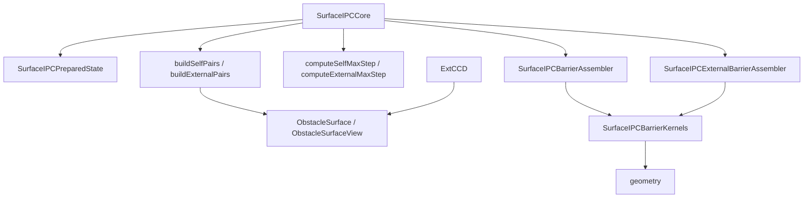

# IPC 系统重构 Implementation Plan

> **For agentic workers:** REQUIRED SUB-SKILL: Use `superpowers:subagent-driven-development` 或
> `superpowers:executing-plans` 来逐 task 执行。每个 step 使用 checkbox (`- [ ]`) 追踪，不要跨 phase 混改。

**Goal:** 在不改变 `SurfaceIPCCore` 公开 API 和数值语义的前提下，把 IPC 系统从”core/assembler 吸收所有逻辑”
重构为 prepared state、self/external broad phase、self/external max-step、barrier assembly 分层清晰的结构。

**Architecture:** 保持当前 `geometry / topology / broadPhase / external / core` 大目录不大搬家。先补安全网和小清理，
再按可独立验证的边界拆 `SurfaceIPCCore`，最后处理 `SurfaceIPCBarrierAssembler` 的重复公式和 scatter 策略。

**Tech Stack:** C++20, Eigen, TBB, CMake, GoogleTest, `ctest`, existing `contact` library.

## 进度总览

| Phase | 状态 | 说明 |
|-------|------|------|
| 0 — Baseline | ✅ | 31 focused + all external tests 基线通过 |
| 1 — 卫生清理与输入校验 | ✅ | 4 项新校验 + include 清理 + debug dump 删除 |
| 2 — 提取 PreparedState | ✅ | 引入 `SurfaceIPCPreparedState`，收拢缓存成员 |
| *2+ — 消除薄转发* | ✅ | 删除 11 个转发方法，暴露 `preparedState()` / `topology()` accessor |
| 3 — 提取 external broad phase | ✅ | 合并为 `surfaceIPCBroadPhase.h/.cpp`，`buildSelfPairs()` / `buildExternalPairs()` 均为自由函数；引入 `SelfPairSet` 与 `ExternalPairSet` 对称 |
| 4 — 提取 external max-step | ✅ | 合并为 `surfaceIPCMaxStep.h/.cpp`，`computeSelfMaxStep()` / `computeExternalMaxStep()` 均为自由函数 |
| 5 — 拆 barrier assembler | ✅ 5A | external 拆到 `surfaceIPCExternalBarrierAssembler.*`；self 改为自由函数并重命名 `surfaceIPCSelfBarrierAssembler.*` |
| 5B — 抽 barrier kernels | ✅ | `surfaceIPCBarrierKernels.h/.cpp`；`pointTriangle()` / `edgeEdge()` kernel；self/external assembler 均使用 kernel；35 focused + external tests 通过 |
| 6 — Obstacle 几何 view | ✅ | `ObstacleSurfaceView` + `view()` + tri area / edge length 缓存到 `ObstacleSurface`，`buildExternalPairs()` 直接读取 |
| 7 — 公开面收缩与验收 | ✅ | 移除 autogen headers 从 CONTACT_HEADERS；surfaceIPCCore.cpp include 干净；全 35 focused + external tests 通过 |

### Phase 3 执行补充说明

实际执行时超出了原始计划，一并完成了以下额外清理：

- **broad phase 文件合并** — `surfaceIPCSelfBroadPhase.*` + `surfaceIPCExternalBroadPhase.*` → `surfaceIPCBroadPhase.h/.cpp`，两个函数 `buildSelfPairs()` / `buildExternalPairs()` 都从 class 改为自由函数。
- **`SelfPairSet` 引入** — 与 `ExternalPairSet` 对称，聚合 `ptPairs` + `eePairs`，`PreparedState` 直接持有 `SelfPairSet` 和 `ExternalPairSet`（不再拆成独立 vector），`findCollisionPairs()` 零拷贝直传。
- **`BarrierAssembler` 签名统一** — self 方法改名为 `computeSelfEnergy/Gradient/Hessian/All`，所有方法参数从独立 vector 改为 `const SelfPairSet&` / `const ExternalPairSet&`，参数名统一为 `dynPos`。
- **删除死代码** — `SurfaceIPCCore` 中未使用的 `static V3d vtx()` 移除。

### Phase 4 执行补充说明

实际执行时超出原始计划，一并完成了以下额外清理：

- **max-step 文件合并** — `SurfaceIPCMaxStep` + `SurfaceIPCExternalMaxStep` 两个 class → `computeSelfMaxStep()` / `computeExternalMaxStep()` 两个自由函数，合并到 `surfaceIPCMaxStep.h/.cpp`。
- **显式 `std::min`** — `computeMaxStepLimit()` 中 self/external alpha 用 `std::min()` 显式取最小，不复用 `tbb::parallel_reduce` 隐式 chain。
- **移除 6 个 stale includes** — `spatialHashGrid.h`、`ipcCCD.h`、4 个 TBB headers 从 `surfaceIPCCore.cpp` 移除。
- **后续拧巴清理** — `CIPC.h` 删除无调用方的 `getPTPairs()`/`getEEPairs()`；`PreparedState` 删除多余的 `#include <vector>`；`surfaceIPCCore.h` 移除 header 中的 `using namespace`、修复缩进。

### Phase 5A 执行补充说明

- **external 拆分** — 8 个 file-local helper + 4 个 `computeExternal*` 方法（~550 行）从 `SurfaceIPCBarrierAssembler` 搬移到 `surfaceIPCExternalBarrierAssembler.h/.cpp`，全部改为自由函数。
- **self 改为自由函数+重命名** — `SurfaceIPCBarrierAssembler` class 删除，4 个 self 方法改为 `computeSelf*` 自由函数；文件重命名为 `surfaceIPCSelfBarrierAssembler.*`，与 external 对称。
- **`testIPCExternal.cpp`** — 删除不再需要的 `surfaceIPCBarrierAssembler.h` include。

## 范围假设

- 仓库根目录当前没有高层 `REFACTOR_PLAN.md`；本文件就是 IPC 局部重构的执行基准。
- external pair 等价测试必须比较 canonical pair identity 和权重，而不只比较数量；TBB 合并顺序可以变化。

---

## 执行原则

- 每个 phase 都必须能单独编译、单独跑 focused tests，并且 public API 尽量保持不变。
- 每个 phase 完成后只记录建议提交边界和提交信息；执行 agent 不运行 `git commit`，除非用户明确要求。
- 不要把 behavior cleanup、文件搬移、数值公式重写放在同一个提交边界里。
- 任何涉及 barrier/gradient/Hessian/CCD 的改动都先写等价测试，再移动实现。
- 所有新增 helper 先服务现有调用路径，不引入新的 feature flag 或模板层级。
- 当前不做全局命名风格迁移；`surfaceIPC*` 文件名和 mixedCase API 先保持。

## 当前问题摘要

- ~~`SurfaceIPCCore` 同时负责参数、mesh、prepared cache、self pair、external pair、external CCD、障碍物注册和日志。~~（已通过 Phase 2-4 拆分）
- `SurfaceIPCBarrierAssembler` ~~超过 1000 行，self/external 的 energy、gradient、Hessian、combined assembly 公式重复。~~（Phase 5A 拆分为 self/external 两个文件，均为自由函数）
- ~~external pair build 每次在 `SurfaceIPCCore` 里临时计算 obstacle tri area/edge length~~（已提取到 `surfaceIPCBroadPhase.cpp`）
- ~~`surfaceIPCCore.h` include 了多个实现细节 header~~（Phase 1+4 清理，去掉了 geometry headers 和 TBB headers）
- `SurfaceIPCCore` 的 `const` compute 方法修改 `mutable` prepared state，当前语义可接受，但边界需要更清楚。

## 目标结构

```text
src/core/contact/ipc/
  broadPhase/
    spatialHashGrid.h/.cpp
    surfaceIPCBroadPhase.h/.cpp              # buildSelfPairs + buildExternalPairs
    surfaceIPCPrimitiveBoxes.h/.cpp          # 可选，Phase 3 或 Phase 4 中按需引入
  core/
    surfaceIPCCore.h/.cpp
    surfaceIPCPreparedState.h
    surfaceIPCSelfBarrierAssembler.h/.cpp     # computeSelf* 自由函数
    surfaceIPCExternalBarrierAssembler.h/.cpp  # computeExternal* 自由函数
    surfaceIPCBarrierKernels.h/.cpp            # Phase 5B: PT/EE local barrier kernels
    surfaceIPCMaxStep.h/.cpp                   # computeSelfMaxStep + computeExternalMaxStep
    surfaceIPCPairs.h                        # PTPair, EEPair, ExternalPTPair/TPPair/EEPair, SelfPairSet, ExternalPairSet
  external/
    obstacleSurface.h/.cpp
    obstacleSurfaceView.h                    # Phase 6: obstaclet 只读 view + 缓存权重指针
  geometry/
    ipcBarrier.h/.cpp
    ipcCCD.h/.cpp
    ipcDistancePrimitives.h/.cpp
    ipcHessianProjection.h/.cpp
```

目标依赖方向：



## 全局验证命令

执行前先确认 preset 可用：

```bash
cmake --preset base_no_mkl
cmake --build --preset base_no_mkl_release --target contact
```

Focused test 集合：

```bash
cmake --build --preset base_no_mkl_release --target \
  ipcGeometry_gtest \
  spatialHashGrid_gtest \
  surfaceIPCTopology_gtest \
  surfaceIPCSelfBroadPhase_gtest \
  surfaceIPCMaxStep_gtest \
  surfaceIPCBarrierAssembler_gtest \
  surfaceIPCCore_gtest \
  cipcPotentialEnergy_gtest \
  embeddedSurfaceIPCPotentialEnergy_gtest

ctest --test-dir build/base_no_mkl \
  -R "ipcGeometry|spatialHashGrid|surfaceIPCTopology|surfaceIPCSelfBroadPhase|surfaceIPCMaxStep|surfaceIPCBarrierAssembler|surfaceIPCCore|cipcPotentialEnergy|embeddedSurfaceIPCPotentialEnergy" \
  --output-on-failure
```

> 注意: Phase 3/4 未创建独立的 `surfaceIPCExternalBroadPhase_gtest` / `surfaceIPCExternalMaxStep_gtest`。
> external broad phase 通过 `surfaceIPCBarrierAssembler_gtest` + `surfaceIPCCore_gtest` 覆盖，
> external max step 通过 `testIPCExternal` 覆盖。

如果改到 `src/tests/testIPCExternal/`，额外执行：

```bash
cmake --build --preset base_no_mkl_release --target testIPCExternal
./build/base_no_mkl/bin/testIPCExternal
```

## Phase 0: Baseline 与执行防线

**目标:** 确认现有测试基线，锁定本轮重构的行为边界。  
**风险:** `[low-risk]`。  
**建议提交边界/信息:** `chore(ipc): record refactor baseline`。仅作为人工提交参考；执行 agent 不代替用户提交。
如果只运行命令不改文件则不需要提交。

**Files:**
- Read: `src/core/contact/ipc/core/surfaceIPCCore.cpp`
- Read: `src/core/contact/ipc/core/surfaceIPCBarrierAssembler.cpp`
- Read: `tests/src/core/contact/surfaceIPCCore_gtest.cpp`
- Read: `tests/src/core/contact/surfaceIPCBarrierAssembler_gtest.cpp`
- Read: `src/tests/testIPCExternal/testIPCExternal.cpp`

- [x] **Step 0.1: 确认工作区干净或只包含本计划文档**

Run:

```bash
git status --short
```

Expected: 除 `src/core/contact/ipc/REFACTOR_PLAN.md` 外没有未解释的改动。

- [x] **Step 0.2: 配置并构建 `contact`**

Run:

```bash
cmake --preset base_no_mkl
cmake --build --preset base_no_mkl_release --target contact
```

Expected: 两条命令 exit code 均为 `0`。

- [x] **Step 0.3: 跑 IPC focused tests**

Run:

```bash
ctest --test-dir build/base_no_mkl \
  -R "ipcGeometry|spatialHashGrid|surfaceIPCTopology|surfaceIPCSelfBroadPhase|surfaceIPCMaxStep|surfaceIPCBarrierAssembler|surfaceIPCCore|cipcPotentialEnergy|embeddedSurfaceIPCPotentialEnergy" \
  --output-on-failure
```

Expected: 所有匹配测试通过。若已有失败，先记录失败测试名，不进入 Phase 1。

- [x] **Step 0.4: 跑 external legacy test**

Run:

```bash
cmake --build --preset base_no_mkl_release --target testIPCExternal
./build/base_no_mkl/bin/testIPCExternal
```

Expected: 进程 exit code 为 `0`。

## Phase 1: 低风险卫生清理与输入校验

**目标:** 先修明显安全边界，减少后续拆分时被无关问题干扰。  
**风险:** `[low-risk]`，行为变化仅限 invalid input 更早抛异常。  
**建议提交边界/信息:** `refactor(ipc): tighten validation and header hygiene`。仅作为人工提交参考；执行 agent 不代替用户提交。

**Files:**
- Modify: `src/core/contact/ipc/core/surfaceIPCCore.h`
- Modify: `src/core/contact/ipc/core/surfaceIPCCore.cpp`
- Modify: `src/core/contact/ipc/topology/surfaceIPCTopology.cpp`
- Modify: `src/core/contact/ipc/external/obstacleSurface.cpp`
- Modify: `src/core/contact/ipc/core/surfaceIPCMaxStep.cpp`
- Modify: `src/core/contact/CMakeLists.txt`
- Test: `tests/src/core/contact/surfaceIPCTopology_gtest.cpp`
- Test: `tests/src/core/contact/surfaceIPCCore_gtest.cpp`
- Test: `src/tests/testIPCExternal/testIPCExternal.cpp` 或新增 `tests/src/core/contact/obstacleSurface_gtest.cpp`

### Task 1.1: 为 invalid input 补测试

- [x] **Step 1.1.1: 给 topology 加非法三角形测试**

Modify `tests/src/core/contact/surfaceIPCTopology_gtest.cpp`，新增两个 case：

```cpp
TEST(SurfaceIPCTopologyGTest, InvalidTriangleColumnCountThrows)
{
  ES::MXd V(3, 3);
  V.setZero();
  ES::MXi F(1, 4);
  F.setZero();

  SurfaceIPCTopology topology;
  EXPECT_THROW(topology.setMesh(V, F), std::invalid_argument);
}

TEST(SurfaceIPCTopologyGTest, OutOfRangeTriangleIndexThrows)
{
  ES::MXd V(3, 3);
  V.setZero();
  ES::MXi F(1, 3);
  F << 0, 1, 3;

  SurfaceIPCTopology topology;
  EXPECT_THROW(topology.setMesh(V, F), std::invalid_argument);
}
```

- [x] **Step 1.1.2: 给 `SurfaceIPCCore::addObstacleSurface()` 加空指针测试**

Modify `tests/src/core/contact/surfaceIPCCore_gtest.cpp`，新增：

```cpp
TEST(SurfaceIPCCoreGTest, AddNullObstacleThrows)
{
  SurfaceIPCCore core;
  EXPECT_THROW(core.addObstacleSurface(nullptr), std::invalid_argument);
}
```

- [x] **Step 1.1.3: 给 `ObstacleSurface` 加空 sampler 测试**

Modify `tests/src/core/contact/surfaceIPCCore_gtest.cpp`，新增：

```cpp
TEST(SurfaceIPCCoreGTest, ObstacleSurfaceEmptySamplerThrows)
{
  ES::MXd V(3, 3);
  V.setZero();
  ES::MXi F(1, 3);
  F << 0, 1, 2;

  EXPECT_THROW(
    pgo::Contact::CIPC::ObstacleSurface(V, F, pgo::Contact::CIPC::ObstacleSurface::TrajectorySampler{}),
    std::invalid_argument);
}
```

- [x] **Step 1.1.4: 验证测试先失败**

Run:

```bash
cmake --build --preset base_no_mkl_release --target surfaceIPCTopology_gtest surfaceIPCCore_gtest
ctest --test-dir build/base_no_mkl -R "surfaceIPCTopology|surfaceIPCCore" --output-on-failure
```

Expected: 至少新增的 invalid-input 测试失败，原因是当前实现没有抛目标异常。若 debug Eigen 因
out-of-range triangle index 直接触发 assertion/abort，先跳过该单个 case，完成 Step 1.2.1 后再恢复运行。

### Task 1.2: 实现输入校验与小清理

- [x] **Step 1.2.1: `SurfaceIPCTopology::setMesh()` 校验 triangle matrix**

Modify `src/core/contact/ipc/topology/surfaceIPCTopology.cpp`：

```cpp
#include <stdexcept>

void SurfaceIPCTopology::setMesh(const EigenSupport::MXd &V, const EigenSupport::MXi &F)
{
  if (V.cols() != 3)
    throw std::invalid_argument("SurfaceIPCTopology: V must be an N x 3 vertex matrix.");
  if (F.cols() != 3)
    throw std::invalid_argument("SurfaceIPCTopology: F must be an N x 3 triangle index matrix.");
  if (F.size() > 0 && (F.minCoeff() < 0 || F.maxCoeff() >= V.rows()))
    throw std::invalid_argument("SurfaceIPCTopology: F contains an out-of-range vertex index.");

  // existing implementation follows
}
```

- [x] **Step 1.2.2: `SurfaceIPCCore::addObstacleSurface()` 校验空指针**

Modify `src/core/contact/ipc/core/surfaceIPCCore.cpp`：

```cpp
int32_t SurfaceIPCCore::addObstacleSurface(std::shared_ptr<ObstacleSurface> obs)
{
  if (!obs)
    throw std::invalid_argument("SurfaceIPCCore::addObstacleSurface: obstacle must not be null.");

  int32_t id = static_cast<int32_t>(obstacles_.size());
  obstacles_.push_back(std::move(obs));
  obstacles_.back()->setObjectId(id);
  invalidatePreparedState();
  return id;
}
```

- [x] **Step 1.2.3: `ObstacleSurface` 校验 sampler**

Modify `src/core/contact/ipc/external/obstacleSurface.cpp` constructor：

```cpp
if (!sampler_)
  throw std::invalid_argument("ObstacleSurface: trajectory sampler must not be empty.");
```

保留 `makeLinearTrajectorySampler()` 的 output size check。

- [x] **Step 1.2.4: 删除 `surfaceIPCMaxStep.cpp` 中注释掉的 debug dump**

Modify `src/core/contact/ipc/core/surfaceIPCMaxStep.cpp`，删除 lines around old commented block containing:

```cpp
std::cout
std::ofstream outfile("/home/user/code/libpgo-private/data/deb.obj")
```

不要改 active CCD 逻辑。

- [x] **Step 1.2.5: 清理 `surfaceIPCCore.h` 中不必要 include**

Modify `src/core/contact/ipc/core/surfaceIPCCore.h`，保留需要完整类型的 include：

```cpp
#include "EigenDef.h"
#include "ipc/core/surfaceIPCPairs.h"
#include "ipc/external/obstacleSurface.h"
#include "ipc/topology/surfaceIPCTopology.h"
#include "solveDiagnostics.h"

#include <cstdint>
#include <memory>
#include <vector>
```

移除 `ipc/geometry/ipcBarrier.h`、`ipc/geometry/ipcCCD.h`、`ipc/geometry/ipcDistancePrimitives.h`、
`ipc/geometry/ipcHessianProjection.h`、`potentialEnergy.h`、`<array>`、`<cmath>`、`<algorithm>`。
`solveDiagnostics.h` 是 `NonlinearOptimization::MaxStepResult` 返回值所需的轻量定义，不要一起删掉。

- [x] **Step 1.2.6: 修正 `src/core/contact/CMakeLists.txt` 缩进**

Modify only the two `ipc/external/obstacleSurface.*` lines，和周围列表保持两个空格缩进。

- [x] **Step 1.2.7: 验证 Phase 1**

Run:

```bash
cmake --build --preset base_no_mkl_release --target contact surfaceIPCTopology_gtest surfaceIPCCore_gtest
ctest --test-dir build/base_no_mkl -R "surfaceIPCTopology|surfaceIPCCore" --output-on-failure
```

Expected: build 通过，新增 invalid-input 测试通过。

## Phase 2: 提取 `SurfaceIPCPreparedState`

**目标:** 把 prepared cache 从 `SurfaceIPCCore` 成员散落状态收拢成一个明确对象。  
**风险:** `[med-risk]`，不改 public API，但会移动缓存成员。  
**建议提交边界/信息:** `refactor(ipc): isolate prepared pair state`。仅作为人工提交参考；执行 agent 不代替用户提交。

**Files:**
- Create: `src/core/contact/ipc/core/surfaceIPCPreparedState.h`
- Modify: `src/core/contact/ipc/core/surfaceIPCCore.h`
- Modify: `src/core/contact/ipc/core/surfaceIPCCore.cpp`
- Modify: `src/core/contact/CMakeLists.txt`
- Test: `tests/src/core/contact/surfaceIPCCore_gtest.cpp`
- Test: `tests/src/core/contact/cipcPotentialEnergy_gtest.cpp`
- Test: `tests/src/core/contact/embeddedSurfaceIPCPotentialEnergy_gtest.cpp`

### Task 2.1: 新增 prepared state value object

- [x] **Step 2.1.1: 创建 header**

Create `src/core/contact/ipc/core/surfaceIPCPreparedState.h`：

```cpp
#pragma once

#include "EigenDef.h"
#include "ipc/core/surfaceIPCPairs.h"

#include <vector>

namespace pgo
{
namespace Contact
{
namespace CIPC
{

struct SurfaceIPCPreparedState
{
  bool hasState = false;
  EigenSupport::VXd positions;
  std::vector<PTPair> ptPairs;
  std::vector<EEPair> eePairs;
  std::vector<ExternalPTPair> externalPTPairs;
  std::vector<ExternalTPPair> externalTPPairs;
  std::vector<ExternalEEPair> externalEEPairs;

  void clear()
  {
    hasState = false;
    positions.resize(0);
    ptPairs.clear();
    eePairs.clear();
    externalPTPairs.clear();
    externalTPPairs.clear();
    externalEEPairs.clear();
  }

  bool isPreparedFor(EigenSupport::ConstRefVecXd x) const
  {
    return hasState &&
      positions.size() == x.size() &&
      (positions.array() == x.array()).all();
  }
};

}  // namespace CIPC
}  // namespace Contact
}  // namespace pgo
```

- [x] **Step 2.1.2: 注册 CMake header**

Modify `src/core/contact/CMakeLists.txt`，在 `ipc/core/surfaceIPCCore.h` 附近加入：

```cmake
  ipc/core/surfaceIPCPreparedState.h
```

### Task 2.2: 替换 `SurfaceIPCCore` 的 mutable 缓存成员

- [x] **Step 2.2.1: 修改 `surfaceIPCCore.h` 成员**

Modify `src/core/contact/ipc/core/surfaceIPCCore.h`：

```cpp
#include "ipc/core/surfaceIPCPreparedState.h"
```

将 private members 中这些成员：

```cpp
mutable std::vector<PTPair> ptPairs_;
mutable std::vector<EEPair> eePairs_;
mutable bool hasPreparedState_ = false;
mutable VXd preparedPositions_;
mutable std::vector<ExternalPTPair> extPTPairs_;
mutable std::vector<ExternalTPPair> extTPPairs_;
mutable std::vector<ExternalEEPair> extEEPairs_;
```

替换为：

```cpp
mutable SurfaceIPCPreparedState preparedState_;
```

- [x] **Step 2.2.2: 更新 accessor**

Modify `surfaceIPCCore.h` accessors：

```cpp
const std::vector<PTPair> &getPTPairs() const { return preparedState_.ptPairs; }
const std::vector<EEPair> &getEEPairs() const { return preparedState_.eePairs; }
const std::vector<ExternalPTPair> &getExternalPTPairs() const { return preparedState_.externalPTPairs; }
const std::vector<ExternalTPPair> &getExternalTPPairs() const { return preparedState_.externalTPPairs; }
const std::vector<ExternalEEPair> &getExternalEEPairs() const { return preparedState_.externalEEPairs; }
```

- [x] **Step 2.2.3: 更新 copy constructor / assignment**

Modify `src/core/contact/ipc/core/surfaceIPCCore.cpp`，把 pair/prepared 成员复制替换为：

```cpp
preparedState_(other.preparedState_),
```

assignment 中使用：

```cpp
preparedState_ = other.preparedState_;
```

- [x] **Step 2.2.4: 更新 invalidate/isPrepared/prepare**

Modify methods：

```cpp
void SurfaceIPCCore::invalidatePreparedState() const
{
  preparedState_.clear();
}

bool SurfaceIPCCore::isPreparedFor(EigenSupport::ConstRefVecXd x_surf) const
{
  return preparedState_.isPreparedFor(x_surf);
}

void SurfaceIPCCore::prepareForSurfacePositions(EigenSupport::ConstRefVecXd x_surf) const
{
  Profiling::ScopedProfileSection scopedProfile(SurfaceIPCProfileSections::kPrepareActivePairs);
  preparedState_.positions = x_surf;
  findCollisionPairs(preparedState_.positions);
  preparedState_.hasState = true;
}
```

Keep the existing logging, but read sizes from `preparedState_`.

- [x] **Step 2.2.5: 更新 compute 调用点**

Replace reads:

```cpp
preparedPositions_ -> preparedState_.positions
ptPairs_ -> preparedState_.ptPairs
eePairs_ -> preparedState_.eePairs
extPTPairs_ -> preparedState_.externalPTPairs
extTPPairs_ -> preparedState_.externalTPPairs
extEEPairs_ -> preparedState_.externalEEPairs
hasPreparedState_ -> preparedState_.hasState
```

Use a mechanical search after editing:

```bash
rg -n "preparedPositions_|ptPairs_|eePairs_|extPTPairs_|extTPPairs_|extEEPairs_|hasPreparedState_" src/core/contact/ipc/core/surfaceIPCCore.*
```

Expected: no stale references except `obstacles_` and names intentionally kept outside prepared state.

- [x] **Step 2.2.6: 验证 Phase 2**

Run:

```bash
cmake --build --preset base_no_mkl_release --target surfaceIPCCore_gtest cipcPotentialEnergy_gtest embeddedSurfaceIPCPotentialEnergy_gtest
ctest --test-dir build/base_no_mkl -R "surfaceIPCCore|cipcPotentialEnergy|embeddedSurfaceIPCPotentialEnergy" --output-on-failure
```

Expected: prepared-pair reuse tests 通过，pair accessor tests 通过。

### Phase 2+ 额外清理：消除薄转发方法（已执行）

在 Phase 2 基础上，`SurfaceIPCCore` 上仍有 11 个方法仅仅转发到 `preparedState_` 或 `topology_` 的字段/方法，
属于不必要的中间层。已全部内联或替换为直接 accessor：

**删除的方法：**
- `bool isPreparedFor(...)` — 调用方改用 `core.preparedState().isPreparedFor(...)`
- `void invalidatePreparedState()` — 内部改用 `preparedState_.clear()`，外部改用 `core.preparedState().clear()`
- `void requirePreparedState()` — 内联到 4 个内部调用点
- `getPTPairs()` / `getEEPairs()` — 调用方改用 `core.preparedState().ptPairs` / `.eePairs`
- `getExternalPTPairs()` / `getExternalTPPairs()` / `getExternalEEPairs()` — 同理
- `getNumSurfaceVertices()` / `getNumSurfaceDOFs()` — 无外部调用方，直接删除

**新增的 accessor：**
```cpp
SurfaceIPCPreparedState& preparedState() const { return preparedState_; }
const SurfaceIPCTopology& topology() const { return topology_; }
```

`preparedState_` 是 `mutable`，所以 const 方法可返回非 const 引用，支持 `clear()` 等修改操作。

**涉及文件（共 8 个）：**
- `surfaceIPCCore.h` / `.cpp`
- `CIPC.h` / `CIPC.cpp`
- `embeddedSurfaceIPCPotentialEnergy.cpp`
- `surfaceIPCCore_gtest.cpp`
- `surfaceIPCSelfBroadPhase_gtest.cpp`
- `cipcPotentialEnergy_gtest.cpp`
- `testIPCExternal.cpp`

**建议提交边界:** `refactor(ipc): replace thin forwarding methods with preparedState()/topology() accessors`

## Phase 3: 提取 external broad phase

**目标:** 把 `SurfaceIPCCore::findCollisionPairs()` 中的 external PT/TP/EE pair build 拆到 `SurfaceIPCExternalBroadPhase`。  
**风险:** `[med-risk]`，候选对顺序可能改变；测试应比较集合或最终 energy/gradient，而不是依赖顺序。  
**建议提交边界/信息:** `refactor(ipc): extract external broad phase`。仅作为人工提交参考；执行 agent 不代替用户提交。

**Files:**
- Modify: `src/core/contact/ipc/core/surfaceIPCPairs.h`
- Create: `src/core/contact/ipc/broadPhase/surfaceIPCExternalBroadPhase.h`
- Create: `src/core/contact/ipc/broadPhase/surfaceIPCExternalBroadPhase.cpp`
- Modify: `src/core/contact/ipc/core/surfaceIPCCore.cpp`
- Modify: `src/core/contact/CMakeLists.txt`
- Create: `tests/src/core/contact/surfaceIPCExternalBroadPhase_gtest.cpp`
- Modify: `tests/src/core/contact/CMakeLists.txt`

### Task 3.1: 引入 external pair set

- [x] **Step 3.1.1: 在 `surfaceIPCPairs.h` 加集合类型**

Add after external pair structs:

```cpp
struct ExternalPairSet
{
  std::vector<ExternalPTPair> ptPairs;
  std::vector<ExternalTPPair> tpPairs;
  std::vector<ExternalEEPair> eePairs;

  void clear()
  {
    ptPairs.clear();
    tpPairs.clear();
    eePairs.clear();
  }

  std::size_t size() const
  {
    return ptPairs.size() + tpPairs.size() + eePairs.size();
  }
};
```

Also add:

```cpp
#include <cstddef>
#include <vector>
```

- [x] **Step 3.1.2: 引入 `SelfPairSet` 并更新 `PreparedState`**

实际执行中同时引入了 `SelfPairSet`（与 `ExternalPairSet` 对称），`PreparedState` 直接持有 `SelfPairSet` 和 `ExternalPairSet`。

### Task 3.2: 合并 self/external broad phase 文件（实际执行）

> 实际执行方向与原始 plan 不同：self 和 external broad phase 合并到 `surfaceIPCBroadPhase.h/.cpp`，两个函数 `buildSelfPairs()` / `buildExternalPairs()` 均为自由函数。未创建独立 `surfaceIPCExternalBroadPhase_gtest`，现有测试通过 `surfaceIPCBarrierAssembler_gtest` 和 `surfaceIPCCore_gtest` 覆盖。

- [x] **Step 3.2.1: 合并 broad phase 实现**

将 self PT/EE pair build 和 external PT/TP/EE pair build 迁入 `surfaceIPCBroadPhase.cpp`，`buildSelfPairs()` / `buildExternalPairs()` 均为自由函数，合并了原计划中的 Task 3.2–3.4。

- [x] **Step 3.2.2: `SelfPairSet` 引入**

在 `surfaceIPCPairs.h` 中添加 `SelfPairSet`（含 `ptPairs` + `eePairs`），与 `ExternalPairSet` 对称。

- [x] **Step 3.2.3: `PreparedState` 更新**

`SurfaceIPCPreparedState` 改为持有 `SelfPairSet selfPairs` 和 `ExternalPairSet externalPairs`。

- [x] **Step 3.2.4: CMake 注册**

`surfaceIPCBroadPhase.h/.cpp` 已注册到 CMakeLists.txt。

- [x] **Step 3.2.5: 验证**

Build + focused tests + external tests 通过。

> 原计划中独立文件 `surfaceIPCExternalBroadPhase.*` 和 test `surfaceIPCExternalBroadPhase_gtest` 未创建，
> 改为合并方案。以下原始 Task 3.2–3.4 的详细步骤保留为历史参考，不再执行。

<details>
<summary>原始 Phase 3 plan（已废弃）</summary>

原始 plan 中 Step 3.2.1 的 test code：

```cpp
#include "ipc/broadPhase/surfaceIPCExternalBroadPhase.h"
#include "ipc/core/surfaceIPCCore.h"
#include "ipc/external/obstacleSurface.h"
#include "ipc/topology/surfaceIPCTopology.h"

#include <gtest/gtest.h>

#include <algorithm>
#include <cmath>
#include <cstdint>
#include <memory>
#include <tuple>
#include <utility>
#include <vector>

namespace ES = pgo::EigenSupport;
using pgo::Contact::CIPC::ExternalPairSet;
using pgo::Contact::CIPC::ExternalEEPair;
using pgo::Contact::CIPC::ExternalPTPair;
using pgo::Contact::CIPC::ExternalTPPair;
using pgo::Contact::CIPC::ObstacleSurface;
using pgo::Contact::CIPC::SurfaceIPCExternalBroadPhase;
using pgo::Contact::CIPC::SurfaceIPCCore;
using pgo::Contact::CIPC::SurfaceIPCTopology;

static ES::VXd flattenRows(const ES::MXd &V)
{
  ES::VXd x(V.rows() * 3);
  for (int vi = 0; vi < V.rows(); ++vi)
    x.segment<3>(3 * vi) = V.row(vi).transpose();
  return x;
}

static std::pair<ES::MXd, ES::MXi> makeUnitSquareMesh()
{
  ES::MXd V(4, 3);
  V << 0.0, 0.0, 0.0,
       1.0, 0.0, 0.0,
       0.0, 1.0, 0.0,
       1.0, 1.0, 0.0;
  ES::MXi F(2, 3);
  F << 0, 1, 2,
       1, 3, 2;
  return { V, F };
}

static std::pair<ES::MXd, ES::MXi> makeSmallBoxObstacle()
{
  ES::MXd V(8, 3);
  V << -0.5, -0.5, -0.5,
        0.5, -0.5, -0.5,
        0.5,  0.5, -0.5,
       -0.5,  0.5, -0.5,
       -0.5, -0.5,  0.5,
        0.5, -0.5,  0.5,
        0.5,  0.5,  0.5,
       -0.5,  0.5,  0.5;
  ES::MXi F(12, 3);
  F << 0, 2, 1,  0, 3, 2,
       4, 5, 6,  4, 6, 7,
       0, 1, 5,  0, 5, 4,
       1, 2, 6,  1, 6, 5,
       2, 3, 7,  2, 7, 6,
       3, 0, 4,  3, 4, 7;
  return { V, F };
}

static long long weightKey(double weight)
{
  return std::llround(weight * 1e12);
}

static auto canonicalPT(const std::vector<ExternalPTPair> &pairs)
{
  std::vector<std::tuple<int32_t, int, int, int, int, long long>> keys;
  keys.reserve(pairs.size());
  for (const auto &pair : pairs)
    keys.emplace_back(
      pair.obstacleObjectId, pair.dynVertex, pair.obsTri[0], pair.obsTri[1], pair.obsTri[2], weightKey(pair.weight));
  std::sort(keys.begin(), keys.end());
  return keys;
}

static auto canonicalTP(const std::vector<ExternalTPPair> &pairs)
{
  std::vector<std::tuple<int32_t, int, int, int, int, long long>> keys;
  keys.reserve(pairs.size());
  for (const auto &pair : pairs)
    keys.emplace_back(
      pair.obstacleObjectId, pair.dynTri[0], pair.dynTri[1], pair.dynTri[2], pair.obsVertex, weightKey(pair.weight));
  std::sort(keys.begin(), keys.end());
  return keys;
}

static auto canonicalEE(const std::vector<ExternalEEPair> &pairs)
{
  std::vector<std::tuple<int32_t, int, int, int, int, long long>> keys;
  keys.reserve(pairs.size());
  for (const auto &pair : pairs)
    keys.emplace_back(
      pair.obstacleObjectId, pair.dynEdge[0], pair.dynEdge[1], pair.obsEdge[0], pair.obsEdge[1], weightKey(pair.weight));
  std::sort(keys.begin(), keys.end());
  return keys;
}

TEST(SurfaceIPCExternalBroadPhaseGTest, BuilderMatchesSurfaceIPCCoreExternalPairs)
{
  auto [V, F] = makeUnitSquareMesh();
  auto [obsV, obsF] = makeSmallBoxObstacle();
  const ES::VXd obsRest = flattenRows(obsV);

  auto obs = std::make_shared<ObstacleSurface>(
    obsV, obsF,
    pgo::Contact::CIPC::makeLinearTrajectorySampler(obsRest, ES::V3d::Zero()));
  obs->update(0.0, 0.0);

  SurfaceIPCCore::Parameters params;
  params.dhat_external = 1.0;
  SurfaceIPCCore core(params);
  core.setMesh(V, F);
  core.addObstacleSurface(obs);

  const ES::VXd x = flattenRows(V);
  core.prepareForSurfacePositions(x);

  SurfaceIPCTopology topology;
  topology.setMesh(V, F);
  std::vector<std::shared_ptr<ObstacleSurface>> obstacles = { obs };

  ExternalPairSet pairs;
  SurfaceIPCExternalBroadPhase().buildPairs(topology, x, obstacles, params.dhat_external, pairs);

  EXPECT_EQ(canonicalPT(pairs.ptPairs), canonicalPT(core.getExternalPTPairs()));
  EXPECT_EQ(canonicalTP(pairs.tpPairs), canonicalTP(core.getExternalTPPairs()));
  EXPECT_EQ(canonicalEE(pairs.eePairs), canonicalEE(core.getExternalEEPairs()));
  EXPECT_GT(pairs.size(), 0u);
}
```

- [ ] **Step 3.2.2: 注册测试 target**

Modify `tests/src/core/contact/CMakeLists.txt`：

```cmake
add_executable(surfaceIPCExternalBroadPhase_gtest surfaceIPCExternalBroadPhase_gtest.cpp)
target_link_libraries(surfaceIPCExternalBroadPhase_gtest PRIVATE GTest::gtest_main contact)
set_property(TARGET surfaceIPCExternalBroadPhase_gtest PROPERTY FOLDER "tests/gtest")
gtest_discover_tests(surfaceIPCExternalBroadPhase_gtest)
```

- [ ] **Step 3.2.3: 验证测试先失败**

Run:

```bash
cmake --build --preset base_no_mkl_release --target surfaceIPCExternalBroadPhase_gtest
```

Expected: build 失败，原因是 `ipc/broadPhase/surfaceIPCExternalBroadPhase.h` 尚不存在。

### Task 3.3: 实现 `SurfaceIPCExternalBroadPhase`

- [ ] **Step 3.3.1: 创建 header**

Create `src/core/contact/ipc/broadPhase/surfaceIPCExternalBroadPhase.h`：

```cpp
#pragma once

#include "EigenDef.h"
#include "ipc/core/surfaceIPCPairs.h"
#include "ipc/external/obstacleSurface.h"
#include "ipc/topology/surfaceIPCTopology.h"

#include <memory>
#include <vector>

namespace pgo
{
namespace Contact
{
namespace CIPC
{

class SurfaceIPCExternalBroadPhase
{
public:
  void buildPairs(
    const SurfaceIPCTopology &topology,
    EigenSupport::ConstRefVecXd positions,
    const std::vector<std::shared_ptr<ObstacleSurface>> &obstacles,
    double dhatExternal,
    ExternalPairSet &pairs) const;
};

}  // namespace CIPC
}  // namespace Contact
}  // namespace pgo
```

- [ ] **Step 3.3.2: 创建 implementation**

Create `src/core/contact/ipc/broadPhase/surfaceIPCExternalBroadPhase.cpp` by moving only the external section from
`SurfaceIPCCore::findCollisionPairs()`。迁移范围包括 dynamic-side vertex/triangle/edge AABB 构建、obstacle AABB 构建、
obstacle tri area / edge length 权重计算，以及 external PT/TP/EE pair 生成；不要把 self pair 逻辑搬进去:

```cpp
#include "ipc/broadPhase/surfaceIPCExternalBroadPhase.h"

#include "ipc/broadPhase/spatialHashGrid.h"
#include "ipc/geometry/ipcDistancePrimitives.h"

#include <tbb/blocked_range.h>
#include <tbb/enumerable_thread_specific.h>
#include <tbb/parallel_for.h>

#include <algorithm>
#include <vector>
```

Keep helper:

```cpp
static EigenSupport::V3d obsVtx(const EigenSupport::VXd &pos, int i)
{
  return pos.segment<3>(3 * i);
}
```

Inside `buildPairs()`, call `pairs.clear()` first, then write to `pairs.ptPairs`, `pairs.tpPairs`, `pairs.eePairs`.

- [ ] **Step 3.3.3: 注册 CMake source/header**

Modify `src/core/contact/CMakeLists.txt`:

```cmake
  ipc/broadPhase/surfaceIPCExternalBroadPhase.h
```

and:

```cmake
  ipc/broadPhase/surfaceIPCExternalBroadPhase.cpp
```

### Task 3.4: 让 core 调用 external builder

- [ ] **Step 3.4.1: 修改 `SurfaceIPCCore::findCollisionPairs()`**

Keep the existing `SurfaceIPCSelfBroadPhase().buildPairs(...)` call at the top of `findCollisionPairs()` exactly once.
Replace only the external block after that call with:

```cpp
preparedState_.externalPTPairs.clear();
preparedState_.externalTPPairs.clear();
preparedState_.externalEEPairs.clear();

if (obstacles_.empty())
  return;

ExternalPairSet externalPairs;
SurfaceIPCExternalBroadPhase().buildPairs(topology_, positions, obstacles_, dhat_external, externalPairs);
preparedState_.externalPTPairs = std::move(externalPairs.ptPairs);
preparedState_.externalTPPairs = std::move(externalPairs.tpPairs);
preparedState_.externalEEPairs = std::move(externalPairs.eePairs);
```

- [ ] **Step 3.4.2: 移除 core 中不再需要的 external broad phase include**

After extraction, `surfaceIPCCore.cpp` should not include `ipc/broadPhase/spatialHashGrid.h` or
`ipc/geometry/ipcDistancePrimitives.h` solely for `findCollisionPairs()`. If external CCD still uses spatial hash in the same file,
keep `spatialHashGrid.h` until Phase 4.

- [ ] **Step 3.4.3: 验证 Phase 3**

Run:

```bash
cmake --build --preset base_no_mkl_release --target surfaceIPCExternalBroadPhase_gtest surfaceIPCCore_gtest testIPCExternal
ctest --test-dir build/base_no_mkl -R "surfaceIPCExternalBroadPhase|surfaceIPCCore" --output-on-failure
./build/base_no_mkl/bin/testIPCExternal
```

Expected: external pair identity/weights and existing external behavior tests 通过。

</details>

## Phase 4: 提取 external max-step/CCD

> **实际执行:** 与 Phase 3 同理，self 和 external max-step 合并到 `surfaceIPCMaxStep.h/.cpp`，`computeSelfMaxStep()` / `computeExternalMaxStep()` 均为自由函数。未创建独立 `surfaceIPCExternalMaxStep_gtest`，现有测试通过 `surfaceIPCMaxStep_gtest` + `surfaceIPCCore_gtest` + `testIPCExternal` 覆盖。Core 中 `computeMaxStepLimit()` 简化为两次自由函数调用 + `std::min`。

**目标:** 把 `SurfaceIPCCore::computeMaxStepLimit()` 中的 external swept AABB + CCD 拆到独立 helper。  
**风险:** `[med-risk]`，CCD alpha 是高敏感路径；必须保留现有 external CCD tests。  
**建议提交边界/信息:** `refactor(ipc): extract external max step`。仅作为人工提交参考；执行 agent 不代替用户提交。

> 以下原始 Phase 4 plan 为历史参考，实际执行中 self 和 external 合并为 `computeSelfMaxStep()` / `computeExternalMaxStep()` 两个自由函数。

<details>
<summary>原始 Phase 4 plan（已废弃）</summary>

**Files:**
- Create: `src/core/contact/ipc/core/surfaceIPCExternalMaxStep.h`
- Create: `src/core/contact/ipc/core/surfaceIPCExternalMaxStep.cpp`
- Modify: `src/core/contact/ipc/core/surfaceIPCCore.cpp`
- Modify: `src/core/contact/CMakeLists.txt`
- Create: `tests/src/core/contact/surfaceIPCExternalMaxStep_gtest.cpp`
- Modify: `tests/src/core/contact/CMakeLists.txt`

### Task 4.1: 写 helper-vs-core 测试

- [ ] **Step 4.1.1: 创建 test file**

Create `tests/src/core/contact/surfaceIPCExternalMaxStep_gtest.cpp`:

```cpp
#include "ipc/core/surfaceIPCExternalMaxStep.h"
#include "ipc/core/surfaceIPCCore.h"
#include "ipc/core/surfaceIPCMaxStep.h"
#include "ipc/external/obstacleSurface.h"
#include "ipc/topology/surfaceIPCTopology.h"

#include <gtest/gtest.h>

#include <memory>
#include <vector>

namespace ES = pgo::EigenSupport;
using pgo::Contact::CIPC::ObstacleSurface;
using pgo::Contact::CIPC::SurfaceIPCExternalMaxStep;
using pgo::Contact::CIPC::SurfaceIPCCore;
using pgo::Contact::CIPC::SurfaceIPCMaxStep;
using pgo::Contact::CIPC::SurfaceIPCTopology;

TEST(SurfaceIPCExternalMaxStepGTest, HelperMatchesSurfaceIPCCoreExternalContribution)
{
  ES::MXd V(4, 3);
  V << 0.0, 0.0, 0.0,
       1.0, 0.0, 0.0,
       0.0, 0.0, 1.0,
       1.0, 0.0, 1.0;
  ES::MXi F(2, 3);
  F << 0, 1, 2,
       1, 3, 2;

  ES::MXd obsV(4, 3);
  obsV << -1.0, 0.5, -1.0,
           2.0, 0.5, -1.0,
          -1.0, 0.5,  2.0,
           2.0, 0.5,  2.0;
  ES::MXi obsF(2, 3);
  obsF << 0, 1, 2,
          1, 3, 2;

  ES::VXd obsRest(obsV.rows() * 3);
  for (int vi = 0; vi < obsV.rows(); ++vi)
    obsRest.segment<3>(3 * vi) = obsV.row(vi).transpose();

  auto obs = std::make_shared<ObstacleSurface>(
    obsV, obsF,
    pgo::Contact::CIPC::makeLinearTrajectorySampler(obsRest, ES::V3d(0.0, -1.0, 0.0)));
  obs->update(0.0, 1.0);

  SurfaceIPCCore::Parameters params;
  params.dhat_external = 0.5;
  params.slackness = 1.0;

  SurfaceIPCCore core(params);
  core.setMesh(V, F);
  core.addObstacleSurface(obs);

  ES::VXd x(V.rows() * 3);
  for (int vi = 0; vi < V.rows(); ++vi)
    x.segment<3>(3 * vi) = V.row(vi).transpose();
  const ES::VXd dx = ES::VXd::Zero(V.rows() * 3);

  SurfaceIPCTopology topology;
  topology.setMesh(V, F);
  const std::vector<std::shared_ptr<ObstacleSurface>> obstacles = { obs };

  const double selfAlpha = SurfaceIPCMaxStep().compute(topology, x, dx, params.dhat, params.slackness);
  ASSERT_NEAR(selfAlpha, 1.0, 1e-12);

  const double helperAlpha = SurfaceIPCExternalMaxStep().compute(
    topology, x, dx, obstacles, params.dhat_external, params.slackness);
  const double coreAlpha = core.computeMaxStepLimit(x, dx).alpha;

  EXPECT_NEAR(helperAlpha, coreAlpha, 1e-12);
  EXPECT_LT(helperAlpha, 1.0);
  EXPECT_GE(helperAlpha, 0.0);
}
```

- [ ] **Step 4.1.2: 注册测试 target 并验证先失败**

Add target in `tests/src/core/contact/CMakeLists.txt`, then run:

```bash
cmake --build --preset base_no_mkl_release --target surfaceIPCExternalMaxStep_gtest
```

Expected: build 失败，原因是 helper header 不存在。

### Task 4.2: 实现 external max-step helper

- [ ] **Step 4.2.1: 创建 header**

Create `src/core/contact/ipc/core/surfaceIPCExternalMaxStep.h`:

```cpp
#pragma once

#include "EigenDef.h"
#include "ipc/external/obstacleSurface.h"
#include "ipc/topology/surfaceIPCTopology.h"

#include <memory>
#include <vector>

namespace pgo
{
namespace Contact
{
namespace CIPC
{

class SurfaceIPCExternalMaxStep
{
public:
  double compute(
    const SurfaceIPCTopology &topology,
    EigenSupport::ConstRefVecXd x,
    EigenSupport::ConstRefVecXd dx,
    const std::vector<std::shared_ptr<ObstacleSurface>> &obstacles,
    double dhatExternal,
    double slackness,
    double initialAlpha = 1.0) const;
};

}  // namespace CIPC
}  // namespace Contact
}  // namespace pgo
```

- [ ] **Step 4.2.2: 创建 implementation**

Create `surfaceIPCExternalMaxStep.cpp` by moving only the external CCD block from `SurfaceIPCCore::computeMaxStepLimit()`.
The method returns the final `alpha`; it must not log or wrap in `MaxStepResult`. If `obstacles.empty()`, return
`initialAlpha` unchanged.

Required includes:

```cpp
#include "ipc/core/surfaceIPCExternalMaxStep.h"

#include "ipc/broadPhase/spatialHashGrid.h"
#include "ipc/geometry/ipcCCD.h"

#include <tbb/blocked_range.h>
#include <tbb/enumerable_thread_specific.h>
#include <tbb/parallel_for.h>
#include <tbb/parallel_reduce.h>

#include <algorithm>
#include <functional>
#include <vector>
```

- [ ] **Step 4.2.3: 注册 CMake**

Modify `src/core/contact/CMakeLists.txt` with header/source entries.

### Task 4.3: 简化 `SurfaceIPCCore::computeMaxStepLimit()`

- [ ] **Step 4.3.1: 调用 helper**

Modify `SurfaceIPCCore::computeMaxStepLimit()`:

```cpp
double alpha = SurfaceIPCMaxStep().compute(topology_, x, dx, dhat, slackness);
alpha = SurfaceIPCExternalMaxStep().compute(topology_, x, dx, obstacles_, dhat_external, slackness, alpha);
```

Keep existing clamping/logging:

```cpp
const double clampedAlpha = std::max(alpha, 1e-12);
return NonlinearOptimization::MaxStepResult::contact(clampedAlpha);
```

- [ ] **Step 4.3.2: 删除 core 中 external CCD 旧代码和不再需要 include**

After deletion, `surfaceIPCCore.cpp` should no longer need TBB headers for external CCD unless another local block still uses them.

- [ ] **Step 4.3.3: 验证 Phase 4**

Run:

```bash
cmake --build --preset base_no_mkl_release --target surfaceIPCExternalMaxStep_gtest surfaceIPCMaxStep_gtest surfaceIPCCore_gtest testIPCExternal
ctest --test-dir build/base_no_mkl -R "surfaceIPCExternalMaxStep|surfaceIPCMaxStep|surfaceIPCCore" --output-on-failure
./build/base_no_mkl/bin/testIPCExternal
```

Expected: external CCD alpha tests 通过，`alpha does not scale obstacle motion` 仍通过。

</details>

## Phase 5: 拆 barrier assembler

**目标:** 先把 external assembly 从 `SurfaceIPCBarrierAssembler` 拆出；再抽局部 contribution kernel，减少公式重复。  
**风险:** `[high-risk]` for Phase 5B，因为数值公式和 Hessian scatter 都敏感。  
**建议提交边界/信息（仅供人工提交参考；执行 agent 不代替用户提交）:**
- `refactor(ipc): split external barrier assembler`
- `refactor(ipc): share local barrier contribution kernels`

**Files:**
- Create: `src/core/contact/ipc/core/surfaceIPCExternalBarrierAssembler.h`
- Create: `src/core/contact/ipc/core/surfaceIPCExternalBarrierAssembler.cpp`
- Create: `src/core/contact/ipc/core/surfaceIPCBarrierKernels.h`
- Create: `src/core/contact/ipc/core/surfaceIPCBarrierKernels.cpp`
- Modify: `src/core/contact/ipc/core/surfaceIPCBarrierAssembler.h`
- Modify: `src/core/contact/ipc/core/surfaceIPCBarrierAssembler.cpp`
- Modify: `src/core/contact/ipc/core/surfaceIPCCore.cpp`
- Modify: `src/core/contact/CMakeLists.txt`
- Test: `tests/src/core/contact/surfaceIPCBarrierAssembler_gtest.cpp`
- Test: `tests/src/core/contact/surfaceIPCCore_gtest.cpp`
- Test: `src/tests/testIPCExternal/testIPCExternal.cpp`

### Task 5A: 只搬 external assembler，不改公式

- [x] **Step 5A.1: 创建 external assembler header**

Create `src/core/contact/ipc/core/surfaceIPCExternalBarrierAssembler.h` with the four external methods currently declared on
`SurfaceIPCBarrierAssembler`.

- [x] **Step 5A.2: 搬移 external helper/static functions**

Move these from `surfaceIPCBarrierAssembler.cpp` to `surfaceIPCExternalBarrierAssembler.cpp`:

```cpp
obsPositions()
obsVtx()
dynVtx()
scatterExternalPTGrad()
scatterExternalTPGrad()
scatterExternalEEGrad()
ExtHessianScatterState
scatterExternalPTHessian()
scatterExternalTPHessian()
scatterExternalEEHessian()
computeExternalEnergy()
computeExternalGradient()
computeExternalHessian()
computeExternalAll()
```

Do not change formula expressions during this step.

- [x] **Step 5A.3: 修改 core 调用**

In `SurfaceIPCCore::{computeEnergyWithPreparedPairs, computeGradientWithPreparedPairs, computeHessianWithPreparedPairs, computeAllWithPreparedPairs}`,
replace:

```cpp
SurfaceIPCBarrierAssembler().computeExternal...
```

with:

```cpp
SurfaceIPCExternalBarrierAssembler().compute...
```

The external class method names may stay `computeEnergy/computeGradient/computeHessian/computeAll` because the class name already says external.

- [x] **Step 5A.4: 验证 external assembler 搬移**

Run:

```bash
cmake --build --preset base_no_mkl_release --target surfaceIPCBarrierAssembler_gtest surfaceIPCCore_gtest testIPCExternal
ctest --test-dir build/base_no_mkl -R "surfaceIPCBarrierAssembler|surfaceIPCCore" --output-on-failure
./build/base_no_mkl/bin/testIPCExternal
```

Expected: self assembler helper test 通过，external legacy tests 通过。

### Task 5B: 抽局部 contribution kernels

- [x] **Step 5B.1: 创建 `surfaceIPCBarrierKernels.h/.cpp`**

Create private helper header:

```cpp
#pragma once

#include "EigenDef.h"

namespace pgo
{
namespace Contact
{
namespace CIPC
{
namespace barrier_kernels
{

struct LocalContribution
{
  double energy = 0.0;
  EigenSupport::V12d gradient = EigenSupport::V12d::Zero();
  EigenSupport::M12d hessian = EigenSupport::M12d::Zero();
  bool active = false;
};

LocalContribution pointTriangle(
  const EigenSupport::V3d &p,
  const EigenSupport::V3d &t0,
  const EigenSupport::V3d &t1,
  const EigenSupport::V3d &t2,
  double weight,
  double dhat2,
  double kappa,
  bool needGradient,
  bool needHessian);

LocalContribution edgeEdge(
  const EigenSupport::V3d &ea0,
  const EigenSupport::V3d &ea1,
  const EigenSupport::V3d &eb0,
  const EigenSupport::V3d &eb1,
  double weight,
  double dhat2,
  double kappa,
  double epsEe,
  bool needGradient,
  bool needHessian);

}  // namespace barrier_kernels
}  // namespace CIPC
}  // namespace Contact
}  // namespace pgo
```

- [x] **Step 5B.1.1: 创建 kernel implementation 并注册 CMake**

Create `src/core/contact/ipc/core/surfaceIPCBarrierKernels.cpp` for the two non-template function definitions. Do not leave only
declarations in the header, otherwise Phase 5B 会通过编译但链接失败。

Required includes:

```cpp
#include "ipc/core/surfaceIPCBarrierKernels.h"

#include "ipc/geometry/ipcBarrier.h"
#include "ipc/geometry/ipcDistancePrimitives.h"
#include "ipc/geometry/ipcHessianProjection.h"
```

Modify `src/core/contact/CMakeLists.txt` with both:

```cmake
  ipc/core/surfaceIPCBarrierKernels.h
  ipc/core/surfaceIPCBarrierKernels.cpp
```

- [x] **Step 5B.2: 迁移 PT formula 到 kernel**

Move PT energy/gradient/Hessian formula from self assembler into `barrier_kernels::pointTriangle()`.
Keep `projectToPSD()` only when `needHessian == true`.

- [x] **Step 5B.3: 迁移 EE formula 到 kernel**

Move EE formula with mollifier handling into `barrier_kernels::edgeEdge()`.
The result must match current behavior for both `eps_ee == 0.0` and `eps_ee > 0.0`.

- [x] **Step 5B.4: self/external assembler 使用 kernel**

Replace duplicated local computations in both assemblers with kernel calls. Keep scatter code separate.

- [x] **Step 5B.5: 验证 finite difference 和 Hessian PSD**

Run:

```bash
cmake --build --preset base_no_mkl_release --target ipcGeometry_gtest surfaceIPCBarrierAssembler_gtest surfaceIPCCore_gtest testIPCExternal
ctest --test-dir build/base_no_mkl -R "ipcGeometry|surfaceIPCBarrierAssembler|surfaceIPCCore" --output-on-failure
./build/base_no_mkl/bin/testIPCExternal
```

Expected: finite-difference gradient/Hessian tests 通过，external energy/gradient/Hessian tests 通过。

### Phase 5B 执行补充说明

- **kernel 设计** — `barrier_kernels::pointTriangle()` 和 `barrier_kernels::edgeEdge()` 返回 `LocalContribution`（energy + V12d gradient + M12d hessian + active flag），`needGradient`/`needHessian` 控制计算内容；Hessian 在 kernel 内已 projectToPSD。
- **TP 复用** — external TP 对调换 point/triangle 参数后直接调用 `pointTriangle()`，公式完全相同。
- **scatter 分离** — scatter 代码留在各自 assembler 中（self: 4-index scatter, external: 1/3/2-index scatter）。
- **geometry includes 移除** — self 和 external assembler 不再直接 include `ipcBarrier.h`/`ipcDistancePrimitives.h`/`ipcHessianProjection.h`，统一通过 kernel 间接依赖。
- **stale test 修复** — `cipcPotentialEnergy_gtest.cpp` 中已删除的 `getPTPairs()`/`getEEPairs()` 调用替换为等价的 self-pair 数量断言（移除，因为 API 已删除且 energy/gradient/hessian 已覆盖验证）。

## Phase 6: Obstacle 几何 view/cache

**目标:** 明确 obstacle current/previous positions 的只读 view，并先把 tri area / edge length 权重计算集中到 helper；
是否进一步缓存到 `ObstacleSurface` 作为可选优化，不能改变权重语义。  
**风险:** `[med-risk]`，权重语义需要保持。  
**建议提交边界/信息:** `refactor(ipc): add obstacle surface geometry view`。仅作为人工提交参考；执行 agent 不代替用户提交。

**Files:**
- Create: `src/core/contact/ipc/external/obstacleSurfaceView.h`
- Modify: `src/core/contact/ipc/external/obstacleSurface.h`
- Modify: `src/core/contact/ipc/external/obstacleSurface.cpp`
- Modify: `src/core/contact/ipc/broadPhase/surfaceIPCBroadPhase.cpp`
- Modify: `src/core/contact/ipc/core/surfaceIPCMaxStep.cpp`
- Modify: `src/core/contact/CMakeLists.txt`
- Test: `src/tests/testIPCExternal/testIPCExternal.cpp` or `tests/src/core/contact/obstacleSurface_gtest.cpp`

### Task 6.1: 明确 obstacle view 类型

- [x] **Step 6.1.1: 创建 view header**

Create `obstacleSurfaceView.h`:

```cpp
#pragma once

#include "EigenDef.h"

#include <cstdint>

namespace pgo
{
namespace Contact
{
namespace CIPC
{

struct ObstacleSurfaceView
{
  int32_t objectId = -1;
  const EigenSupport::VXd *previousPositions = nullptr;
  const EigenSupport::VXd *currentPositions = nullptr;
  const EigenSupport::MXi *triangles = nullptr;
  const EigenSupport::MXi *uniqueEdges = nullptr;
};

}  // namespace CIPC
}  // namespace Contact
}  // namespace pgo
```

- [x] **Step 6.1.2: 给 `ObstacleSurface` 暴露 view**

Add method:

```cpp
#include "ipc/external/obstacleSurfaceView.h"

ObstacleSurfaceView view() const;
```

Modify `src/core/contact/ipc/external/obstacleSurface.cpp`:

```cpp
ObstacleSurfaceView ObstacleSurface::view() const
{
  return {
    objectId_,
    &previous_,
    &current_,
    &triangles_,
    &uniqueEdges_,
  };
}
```

### Task 6.2: 缓存/集中计算权重

- [x] **Step 6.2.1: 把 obstacle tri area / edge length 计算移到 helper 函数**

Add internal helper in `surfaceIPCBroadPhase.cpp`:

```cpp
static std::vector<double> computeTriangleAreas(const EigenSupport::VXd &positions, const EigenSupport::MXi &triangles);
static std::vector<double> computeEdgeLengths(const EigenSupport::VXd &positions, const EigenSupport::MXi &edges);
```

This is an intermediate step before caching on `ObstacleSurface`; it keeps Phase 6 behavior identical. Do not claim the
weight calculation has been removed from broad phase unless Step 6.2.2 is actually implemented.

- [x] **Step 6.2.2: 可选地把 helper 结果缓存进 `ObstacleSurface`**

Only do this if profiling shows repeated cost matters. If caching, invalidate/recompute in `ObstacleSurface::update()`.

- [x] **Step 6.2.3: 验证 Phase 6**

Run:

```bash
cmake --build --preset base_no_mkl_release --target surfaceIPCSelfBroadPhase_gtest surfaceIPCCore_gtest testIPCExternal
ctest --test-dir build/base_no_mkl -R "surfaceIPCSelfBroadPhase|surfaceIPCCore" --output-on-failure
./build/base_no_mkl/bin/testIPCExternal
```

Expected: external pair identity/weights and external energy/CCD behavior unchanged.

### Phase 6 执行补充说明

- **`ObstacleSurfaceView`** — 含 7 个 const 指针：`objectId`, `previousPositions`, `currentPositions`, `triangles`, `uniqueEdges`, `triAreas`, `edgeLengths`。
- **缓存** — tri area / edge length 在 `ObstacleSurface::update()` 中从 `current_` 计算并缓存到 `triAreas_` / `edgeLengths_`，通过 `triAreas()` / `edgeLengths()` 访问器暴露。
- **`buildExternalPairs()`** — 不再临时计算 obstacle 权重，直接读 `obs->triAreas()` / `obs->edgeLengths()`。
- **CMake** — `obstacleSurfaceView.h` 已注册到 `CONTACT_HEADERS`。

## Phase 7: 公开面收缩与最终验收

**目标:** 收尾 include/CMake 公开面，确认全 IPC focused tests 稳定。  
**风险:** `[low-risk]`。  
**建议提交边界/信息:** `chore(ipc): finalize refactor boundaries`。仅作为人工提交参考；执行 agent 不代替用户提交。

**Files:**
- Modify: `src/core/contact/CMakeLists.txt`
- Modify: headers under `src/core/contact/ipc/`
- Test: all IPC/contact focused tests

- [x] **Step 7.1: 检查 generated headers 是否被外部直接 include**

Run:

```bash
rg -n "ipc/geometry/generated/CIPC_autogen" src tests
```

Expected: 只有 `src/core/contact/ipc/geometry/ipcDistancePrimitives.cpp` 直接 include。若是这样，把 generated headers 从
`CONTACT_HEADERS` 中移除；如果存在下游 include，先保留。

- [x] **Step 7.2: 检查 `surfaceIPCCore.cpp` 是否还 include 低层实现细节**

Run:

```bash
rg -n "#include" src/core/contact/ipc/core/surfaceIPCCore.cpp
```

Expected: `surfaceIPCCore.cpp` 主要 include high-level helpers，不再直接 include `spatialHashGrid.h` 和
`ipcDistancePrimitives.h`，除非有剩余本地代码需要。

- [x] **Step 7.3: 跑完整 focused test 集合**

Run:

```bash
cmake --build --preset base_no_mkl_release --target \
  ipcGeometry_gtest \
  spatialHashGrid_gtest \
  surfaceIPCTopology_gtest \
  surfaceIPCSelfBroadPhase_gtest \
  surfaceIPCMaxStep_gtest \
  surfaceIPCBarrierAssembler_gtest \
  surfaceIPCCore_gtest \
  cipcPotentialEnergy_gtest \
  embeddedSurfaceIPCPotentialEnergy_gtest \
  testIPCExternal

ctest --test-dir build/base_no_mkl \
  -R "ipcGeometry|spatialHashGrid|surfaceIPCTopology|surfaceIPCSelfBroadPhase|surfaceIPCMaxStep|surfaceIPCBarrierAssembler|surfaceIPCCore|cipcPotentialEnergy|embeddedSurfaceIPCPotentialEnergy" \
  --output-on-failure

./build/base_no_mkl/bin/testIPCExternal
```

Expected: build 和 tests 全部 exit code `0`。

## Rollback 策略

- Phase 1 可以整体回滚，不影响后续架构；如果用户之后按 phase 自行提交，也可以按该提交边界回滚。
- Phase 2 如果 prepared tests 失败，优先回滚 `surfaceIPCPreparedState.h` 和 `surfaceIPCCore.*`，不要同时调公式。
- Phase 3/4 如果 external tests 失败，保留新增 test，回滚 helper 调用，让 test 继续作为迁移目标。
- Phase 5B 如果有限差分失败，只回滚 kernel 抽象，保留 Phase 5A 的 external assembler 拆分。
- Phase 6 是可选性能/清晰度阶段；如果 view/cache 让权重语义变复杂，可以跳过，不阻塞核心架构收益。

## 完成定义

- `SurfaceIPCCore.cpp` 不再包含 external broad phase 和 external CCD 的大段算法。
- `SurfaceIPCBarrierAssembler.cpp` 只负责 self assembly 或作为窄 facade；external assembly 在独立文件。
- public API 对现有调用方保持兼容。
- `testIPCExternal`、`surfaceIPCCore_gtest`、`surfaceIPCBarrierAssembler_gtest`、`embeddedSurfaceIPCPotentialEnergy_gtest`
  都通过。
- 新增文件都在 `src/core/contact/CMakeLists.txt` 注册。
- 没有带绝对路径的 debug dump、长期注释掉的大段实验代码、或不必要的 generated public header 暴露。
