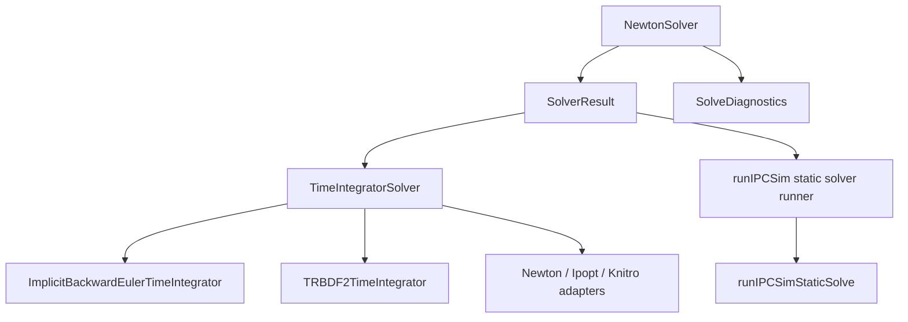

# Solver 体系重构 Implementation Plan

> **For agentic workers:** REQUIRED SUB-SKILL: Use `superpowers:subagent-driven-development` 或
> `superpowers:executing-plans` 来逐 task 执行。每个 step 使用 checkbox (`- [ ]`) 追踪，不要跨 phase 混改。

**Goal:** 在不改变 Newton 数值算法、line-search 行为、IPC active-set 语义、dynamic timestep 接受策略和
external solver backend 行为的前提下，把 solver 体系从 `int` return code + scattered policy 直接迁移到 typed
result、明确的 static/dynamic 接受策略、可复用诊断和清晰 backend boundary。不做向前兼容适配，仓库内调用方一次性使用新 API。

**Architecture:** 本轮不是重写 solver framework，也不是把 static 和 dynamic 数学问题强行合并。核心方向是：
`NewtonSolver` 继续是通用 unconstrained energy minimizer；`TimeIntegratorSolver` 作为 dynamic backend adapter；
`runIPCSimStaticSolve` 使用小型 solver runner 执行 strict static policy；`SolveDiagnostics` 和新 `SolverResult`
作为跨层统一结果载体。先建立新 API，再一次性迁移仓库内调用方，最后清理 adapter 内部结构。

**Tech Stack:** C++20, Eigen, CMake, GoogleTest, existing `nonlinearOptimization`, `simulation`, `runIPCSimCore`.

---

## 当前事实

- 当前 solver 相关主边界：
  - `src/core/nonlinearOptimization/NewtonSolver.h/.cpp`
  - `src/core/nonlinearOptimization/solveDiagnostics.h`
  - `src/core/nonlinearOptimization/minimizeEnergy.h/.cpp`
  - `src/core/simulation/timeIntegratorSolver.h/.cpp`
  - `src/core/simulation/timeIntegrator.h/.cpp`
  - `src/core/simulation/implicitBackwardEulerTimeIntegrator.h/.cpp`
  - `src/core/simulation/TRBDF2TimeIntegrator.h/.cpp`
  - `src/tools/runSim/runIPCSimStaticSolve.cpp`
  - `src/tools/runSim/runIPCSimLoop.cpp`
  - `src/tools/runSim/runIPCSimLogging.cpp`
- `NewtonSolver::SolveStatus` 已经是 typed enum，但 public `solve(...)` 仍返回 `int`。
- `NewtonSolver::solveStatusToString(int)` 当前服务旧 `int` API 和日志输出。
- `SolveDiagnostics` 已经记录 max-step / line-search / final-gradient 信息，但没有统一 solver status 和 iteration count。
- `NewtonSolver::solve()` 的主循环已经被拆成 helper：
  - `evaluateCurrentState(...)`
  - `prepareReducedSystem(...)`
  - `ensureLinearSolver(...)`
  - `solveReducedNewtonDirection(...)`
  - `expandReducedStep(...)`
  - `runLineSearchStep(...)`
- `TimeIntegratorSolver::solve(...)` 返回 `int`，并只通过 `getLastSolveDiagnostics()` 暴露诊断。
- `TimeIntegrator` base class 当前只保存 `int solverRet`，没有保存 typed result；如果要给所有 integrator 暴露 typed
  getter，需要在 base class 增加 `SolverResult lastSolverResult`，由派生 timestep 实现每次 solve 后同步。
- `ImplicitBackwardEulerTimeIntegrator` 当前接受：
  - `Converged`
  - `MaxIterations`
  - `StepTooSmall`
  作为可继续 timestep 的结果。
- `runIPCSimStaticSolve.cpp` 当前直接构造 `NewtonSolver`，且 static policy 是 strict：非 `Converged` 抛异常。
- `TRBDF2TimeIntegrator` 目前没有像 IBE 一样统一格式化 solver result，也没有明确 typed accept policy。
- `timeIntegratorSolver.cpp` 中 optional backend 宏存在历史痕迹：include 使用 `PGO_HAS_IPOPT` / `PGO_HAS_KNITRO`，
  部分实现分支仍检查 `USE_IPOPT` / `USE_KNITRO`。本计划只在专门 phase 处理，不混进 typed result 迁移。

## 范围与非目标

### 范围

- 新增 solver result/status helper，逐步替代散落的 raw `int` 判断。
- 删除旧 `int solve(...)` 主 API，新增并直接使用 typed `solve(...)`。
- 给 static 和 dynamic 各自建立明确 policy，避免 “static 是否等价 dynamic 长时间积分” 这种语义误用。
- 让 `TimeIntegratorSolver`、`ImplicitBackwardEulerTimeIntegrator`、`TRBDF2TimeIntegrator` 消费统一 result。
- 让 `runIPCSimStaticSolve` 复用一个小型 static solver runner，而不是手写状态检查和错误文本。
- 增强 tests，锁住现有行为。

### 非目标

- 不改变 Newton search direction、damping、relative convergence、loose fallback、line-search active-set scope。
- 不改变 `PotentialEnergy` public virtual API。
- 不改变 IPC contact、legacy penalty contact 或 material max-step 数学语义。
- 不把 static solve 改成 `TimeIntegrator`。
- 不保留旧 `int` return API；仓库内调用点直接迁到 typed result/status。
- 不要求没有 Ipopt/Knitro 的本地配置能测试外部 solver 成功路径。
- 不做全局命名风格迁移，例如 `NewtonSolver` 文件名、mixedCase API 本轮保留。

## 目标依赖图



## 目标 API 草图

新增文件：

- `src/core/nonlinearOptimization/solverResult.h`

建议内容：

```cpp
#pragma once

#include "solveDiagnostics.h"

namespace pgo::NonlinearOptimization
{

enum class SolveStatus : int
{
  Converged = 0,
  MaxIterations = 1,
  LineSearchFailed = 2,
  StepTooSmall = 3,
  NonFinite = 4,
  LinearSolveFailed = 5,
  ExternalSolverFailure = 100,
  UnsupportedBackend = 101
};

struct SolverResult
{
  SolveStatus status = SolveStatus::MaxIterations;
  int iterations = 0;
  int rawStatusCode = static_cast<int>(SolveStatus::MaxIterations);
  double finalGradientNorm = 0.0;
  double finalGradientMaxNorm = 0.0;
  bool hasFinalGradientStats = false;
  SolveDiagnostics diagnostics;

  bool converged() const { return status == SolveStatus::Converged; }
};

const char *solveStatusToString(SolveStatus status);
const char *solveStatusToString(int status);
bool isNewtonStatusCode(int status);

}  // namespace pgo::NonlinearOptimization
```

迁移策略：

- `SolveStatus` 从 `NewtonSolver` 直接平移到 `solverResult.h`。
- 删除 `NewtonSolver::SolveStatus` nested enum。
- 删除 `NewtonSolver::solveStatusToString(int)` forwarding wrapper。
- 仓库内调用方统一使用：

```cpp
NonlinearOptimization::SolveStatus::Converged
NonlinearOptimization::solveStatusToString(result.status)
```

这会破坏仍然使用旧 API 的外部代码；这是本轮有意接受的 API cleanup。

## Phase 0: Baseline 与计划防线

**目标:** 确认当前代码和测试基线，避免在已有失败上继续重构。  
**风险:** `[low-risk]`。  
**建议提交边界:** 不需要提交，除非只提交本计划文档。  

**Files:**
- Read: `src/core/nonlinearOptimization/NewtonSolver.h/.cpp`
- Read: `src/core/nonlinearOptimization/solveDiagnostics.h`
- Read: `src/core/simulation/timeIntegratorSolver.h/.cpp`
- Read: `src/core/simulation/implicitBackwardEulerTimeIntegrator.cpp`
- Read: `src/core/simulation/TRBDF2TimeIntegrator.cpp`
- Read: `src/tools/runSim/runIPCSimStaticSolve.cpp`
- Test: `tests/src/core/NewtonSolver_gtest.cpp`
- Test: `tests/src/core/implicitBackwardEulerTimeIntegrator_gtest.cpp`
- Test: `tests/src/tools/runIPCSim_gtest.cpp`

- [ ] **Step 0.1: 确认工作区状态**

Run:

```bash
git status --short
```

Expected: 除本计划文档外没有未解释改动。

- [ ] **Step 0.2: 构建 focused targets**

Run:

```bash
cmake --build --preset base_no_mkl_release --target \
  NewtonSolver_gtest \
  implicitBackwardEulerTimeIntegrator_gtest \
  runIPCSim_gtest \
  runSimShared_gtest
```

Expected: build exit code 为 `0`。

- [ ] **Step 0.3: 跑 focused tests**

Run:

```bash
./build/base_no_mkl/tests/src/core/NewtonSolver_gtest
./build/base_no_mkl/tests/src/core/implicitBackwardEulerTimeIntegrator_gtest
./build/base_no_mkl/tests/src/tools/runIPCSim_gtest
./build/base_no_mkl/tests/src/tools/runSimShared_gtest
```

Expected: 全部通过。若失败，先停下记录失败，不进入 Phase 1。

## Phase 1: 引入 typed solver result，删除旧状态 API

**目标:** 建立统一 `SolverResult` / `SolveStatus` 表达，并移除 `NewtonSolver` nested status API。  
**风险:** `[med-risk]`，涉及 public header 和全仓调用点迁移。  
**建议提交信息:** `refactor: add typed solver result`.

**Files:**
- Create: `src/core/nonlinearOptimization/solverResult.h`
- Create: `src/core/nonlinearOptimization/solverResult.cpp`
- Modify: `src/core/nonlinearOptimization/NewtonSolver.h`
- Modify: `src/core/nonlinearOptimization/NewtonSolver.cpp`
- Modify: `src/core/nonlinearOptimization/CMakeLists.txt`
- Modify: `tests/src/core/NewtonSolver_gtest.cpp`

- [ ] **Step 1.1: 提取 `SolveStatus` 和 string helper**

Move the enum values currently in `NewtonSolver::SolveStatus` into `solverResult.h`.

Remove from `NewtonSolver`:

```cpp
static const char *solveStatusToString(int status);
enum class SolveStatus : int;
```

Add free functions in `solverResult.h/.cpp`:

```cpp
const char *solveStatusToString(SolveStatus status);
const char *solveStatusToString(int status);
```

Expected:

- Code using `NewtonSolver::SolveStatus::Converged` no longer compiles and must be migrated.
- Code using `NewtonSolver::solveStatusToString(...)` no longer compiles and must be migrated.
- New code uses `NonlinearOptimization::SolveStatus::Converged`.

- [ ] **Step 1.2: 新增 `SolverResult`**

Add `SolverResult` to `solverResult.h`.

Rules:

- `status` is the source of truth.
- `rawStatusCode` records the original backend code for diagnostics only. For Newton it is `static_cast<int>(status)`;
  for Ipopt/Knitro it is the solver-native return code.
- `diagnostics` contains detailed max-step / line-search information.
- `finalGradientNorm` and `finalGradientMaxNorm` mirror diagnostics only for convenience.
- `iterations` can initially be best-effort. Do not use it for behavior decisions until Phase 2 records it reliably.

- [ ] **Step 1.3: 迁移 status tests 到 free API**

In `tests/src/core/NewtonSolver_gtest.cpp`, replace `NewtonSolver::solveStatusToString(...)` assertions with:

```cpp
EXPECT_STREQ(solveStatusToString(SolveStatus::Converged), "Converged");
EXPECT_STREQ(solveStatusToString(static_cast<int>(SolveStatus::Converged)), "Converged");
```

Also test unknown raw code:

```cpp
EXPECT_STREQ(solveStatusToString(999), "Unknown");
```

- [ ] **Step 1.4: 验证 Phase 1**

Run:

```bash
cmake --build --preset base_no_mkl_release --target NewtonSolver_gtest
./build/base_no_mkl/tests/src/core/NewtonSolver_gtest
```

Expected: all tests pass.

## Phase 2: 将 `NewtonSolver::solve(...)` 直接改为 typed API

**目标:** 让 `NewtonSolver::solve(...)` 直接返回 `SolverResult`，删除旧 `int solve(...)`。  
**风险:** `[med-risk]`，容易不小心改 status 或 diagnostics reset 时机。  
**建议提交信息:** `refactor: return typed result from Newton solver`.

**Files:**
- Modify: `src/core/nonlinearOptimization/NewtonSolver.h`
- Modify: `src/core/nonlinearOptimization/NewtonSolver.cpp`
- Modify: `tests/src/core/NewtonSolver_gtest.cpp`

- [ ] **Step 2.1: 替换 `solve(...)` signature**

Replace:

```cpp
int solve(double *x, int numIter, double epsilon, int verbose);
```

with:

```cpp
SolverResult solve(double *x, int numIter, double epsilon, int verbose);
```

Do not add `solveWithResult(...)`; the new API is the only API.

- [ ] **Step 2.2: 主循环内部使用 `SolveStatus` 而不是 `int`**

Inside `solve(...)`:

- Replace local `int status` with `SolveStatus status`.
- Avoid converting status to `int` except when passing through raw external APIs or exact legacy log fields that still need raw code.
- Preserve all current status assignment behavior exactly.

- [ ] **Step 2.3: 可靠记录 iteration count**

Define iteration count semantics:

- If converged before taking a Newton step at loop iteration `iter`, `iterations = iter`.
- If one step was attempted during loop iteration `iter`, count it as `iter + 1`.
- If `numIter == 0`, result should be `MaxIterations` with `iterations = 0`.

Do not use iteration count to alter behavior.

- [ ] **Step 2.4: 填充 result diagnostics**

At return:

```cpp
SolverResult result;
result.status = status;
result.iterations = completedIterations;
result.diagnostics = solveDiagnostics;
if (solveDiagnostics.hasFinalGradientStats) {
  result.hasFinalGradientStats = true;
  result.finalGradientNorm = solveDiagnostics.finalGradientNorm;
  result.finalGradientMaxNorm = solveDiagnostics.finalGradientMaxNorm;
}
```

- [ ] **Step 2.5: 迁移 Newton tests 到 typed API**

Update all existing `NewtonSolver_gtest` call sites:

```cpp
const SolverResult result = solver.solve(x.data(), 8, 1e-10, 0);
EXPECT_EQ(result.status, SolveStatus::Converged);
```

Add tests:

- `SolveReturnsDiagnostics`
- `SolveRecordsIterationsForImmediateConvergence`
- `SolveRecordsZeroIterationsForZeroMaxIter`

- [ ] **Step 2.6: 验证 Phase 2**

Run:

```bash
cmake --build --preset base_no_mkl_release --target NewtonSolver_gtest
./build/base_no_mkl/tests/src/core/NewtonSolver_gtest
```

Expected: all tests pass.

## Phase 3: 迁移 `TimeIntegratorSolver` 到 typed result

**目标:** `TimeIntegratorSolver::solve(...)` 直接返回 `SolverResult`，dynamic timestep acceptance 改用 typed status。  
**风险:** `[med-risk]`，dynamic timestep acceptance 当前依赖 raw `int`。  
**建议提交信息:** `refactor: track typed results in time integrator solver`.

**Files:**
- Modify: `src/core/simulation/timeIntegratorSolver.h`
- Modify: `src/core/simulation/timeIntegratorSolver.cpp`
- Modify: `src/core/simulation/timeIntegrator.h`
- Modify: `src/core/simulation/implicitBackwardEulerTimeIntegrator.cpp`
- Modify: `src/core/simulation/TRBDF2TimeIntegrator.cpp`
- Modify: `tests/src/core/implicitBackwardEulerTimeIntegrator_gtest.cpp`

- [ ] **Step 3.1: `TimeIntegratorSolver` API 改为 typed result**

Replace public signature:

```cpp
int solve(...);
```

with:

```cpp
NonlinearOptimization::SolverResult solve(...);
```

Keep:

```cpp
const SolveDiagnostics &getLastSolveDiagnostics() const;
```

implemented as:

```cpp
return da->lastSolveResult.diagnostics;
```

Add:

```cpp
const NonlinearOptimization::SolverResult &getLastSolveResult() const;
```

`TimeIntegratorSolverData` stores:

```cpp
NonlinearOptimization::SolverResult lastSolveResult;
```

- [ ] **Step 3.2: Newton backend 使用 typed `solve(...)`**

For `SO_NEWTON`:

```cpp
da->lastSolveResult = da->newtonSolver->solve(x.data(), nIter, eps, verbose);
return da->lastSolveResult;
```

Preserve fixed DOF extraction from `xlow == xhi`.

- [ ] **Step 3.3: External backend result adapter**

For Knitro/Ipopt/minimize paths, convert raw code into `SolverResult` without interpreting success too aggressively:

- raw `0` -> `SolveStatus::Converged`
- raw nonzero -> `SolveStatus::ExternalSolverFailure`
- `rawStatusCode = raw code`
- `diagnostics.reset()`
- `iterations = 0`

Decision:

- `solve(...)` returns `SolverResult` for every backend.
- `status` is typed and coarse for external solvers.
- `rawStatusCode` preserves backend-specific code for logging/debugging only.

- [ ] **Step 3.4: `TimeIntegrator` base 保存 typed result 并暴露 getter**

Add to `TimeIntegrator` protected data:

```cpp
NonlinearOptimization::SolverResult lastSolverResult;
```

Add public getters:

```cpp
const NonlinearOptimization::SolverResult &getLastSolveResult() const;
NonlinearOptimization::SolveStatus getSolverStatus() const;
```

Remove:

```cpp
int getSolverReturn() const;
```

Implementation rule:

- `getLastSolveResult()` returns `lastSolverResult`.
- `getSolverStatus()` returns `lastSolverResult.status`.
- Derived classes must assign `lastSolverResult` directly from their `TimeIntegratorSolver::solve(...)` return value.

Tests that currently assert `getSolverReturn()` must migrate to typed status/result.

- [ ] **Step 3.5: IBE 同步 typed result 并使用 typed acceptance helper**

Replace:

```cpp
solverRet = solver->solve(...);
```

with:

```cpp
lastSolverResult = solver->solve(...);
```

In `implicitBackwardEulerTimeIntegrator.cpp`, add file-local helper:

```cpp
bool acceptsDynamicSolveStatus(NonlinearOptimization::SolveStatus status)
{
  return status == SolveStatus::Converged ||
    status == SolveStatus::MaxIterations ||
    status == SolveStatus::StepTooSmall;
}
```

Use this helper to compute `acceptedTimestep` from `lastSolverResult.status`. Preserve current behavior exactly.
Any place that still needs a numeric code for diagnostics should use `lastSolverResult.rawStatusCode`.

- [ ] **Step 3.6: TRBDF2 同步 typed result 并使用 status string**

Replace each stage solve assignment with:

```cpp
lastSolverResult = solver[stage]->solve(...);
```

Update residual logging to print status string and, if useful, `rawStatusCode`.
Do not change TRBDF2 acceptance semantics in this phase.

- [ ] **Step 3.7: 验证 Phase 3**

Run:

```bash
cmake --build --preset base_no_mkl_release --target \
  NewtonSolver_gtest \
  implicitBackwardEulerTimeIntegrator_gtest

./build/base_no_mkl/tests/src/core/NewtonSolver_gtest
./build/base_no_mkl/tests/src/core/implicitBackwardEulerTimeIntegrator_gtest
```

Expected:

- Existing tests are migrated away from `getSolverReturn()`.
- New `getLastSolveResult()` / `getSolverStatus()` expectations pass.

## Phase 4: 抽出 runIPCSim static solver runner

**目标:** 保持 static strict policy，但让错误信息、diagnostics、status 处理复用统一 solver result。  
**风险:** `[low-risk]`，主要是 runIPCSim static 输出和异常文本变动。  
**建议提交信息:** `refactor: centralize runIPCSim static solver policy`.

**Files:**
- Create: `src/tools/runSim/runIPCSimSolverRunner.h`
- Create: `src/tools/runSim/runIPCSimSolverRunner.cpp`
- Modify: `src/tools/runSim/runIPCSimStaticSolve.cpp`
- Modify: `src/tools/runSim/CMakeLists.txt`
- Modify: `tests/src/tools/runIPCSim_gtest.cpp`

- [ ] **Step 4.1: 新增 static solver helper**

Create:

```cpp
struct StaticSolveResult
{
  NonlinearOptimization::SolverResult solver;
  EigenSupport::VXd u;
};

StaticSolveResult solveStaticEnergyStrict(
  NonlinearOptimization::PotentialEnergy_const_p energy,
  int numDofs,
  int maxIterations,
  double epsilon,
  int verbose);
```

Rules:

- Constructs `NewtonSolver` with `solverParam.addDamping = 1`.
- Initial `u` is zero, matching current `runIPCSimStaticSolve`.
- Fixed DOFs remain empty for now; attachments are represented by pulling energies, matching current behavior.
- Throws `std::runtime_error` unless status is `Converged`.
- Error text includes status string and final gradient max norm if available.

- [ ] **Step 4.2: `runIPCSimStaticSolve` delegates only solve policy**

Keep energy construction in `runIPCSimStaticSolve.cpp`.

Replace direct solver construction with:

```cpp
const StaticSolveResult staticResult = solveStaticEnergyStrict(
  energyAll, n3, runtimeConfig.solverMaxIter, runtimeConfig.solverEps, 2);
const ES::VXd &u = staticResult.u;
```

Do not move static energy assembly in this phase.

- [ ] **Step 4.3: Tests for strict static failure text**

Extend existing static failure tests in `tests/src/tools/runIPCSim_gtest.cpp` to assert the thrown message contains a stable
status name, for example:

```cpp
EXPECT_NE(message.find("status=MaxIterations"), std::string::npos);
```

Do not assert exact full message.

- [ ] **Step 4.4: 验证 Phase 4**

Run:

```bash
cmake --build --preset base_no_mkl_release --target runIPCSim_gtest runSimShared_gtest
./build/base_no_mkl/tests/src/tools/runIPCSim_gtest
./build/base_no_mkl/tests/src/tools/runSimShared_gtest
```

Expected: all tests pass.

## Phase 5: 明确 solver backend boundary

**目标:** 清理 `TimeIntegratorSolver` 的 backend 分支，使 Newton / Ipopt / Knitro 的状态转换集中且可测试。  
**风险:** `[med-risk]`，optional backend 宏和返回码容易影响不同构建。  
**建议提交信息:** `refactor: isolate time integrator solver backends`.

**Files:**
- Modify: `src/core/simulation/timeIntegratorSolver.h`
- Modify: `src/core/simulation/timeIntegratorSolver.cpp`
- Optionally Modify: `src/core/nonlinearOptimization/minimizeEnergy.h/.cpp`
- Modify: `tests/src/core/implicitBackwardEulerTimeIntegrator_gtest.cpp`

- [ ] **Step 5.1: 引入 file-local backend helper**

Inside `timeIntegratorSolver.cpp`, split current large `solve(...)` into private file-local helpers:

```cpp
int solveWithNewtonBackend(...);
int solveWithKnitroBackend(...);
int solveWithIpoptBackend(...);
```

They still return raw `int`, but each updates `da->lastSolveResult`.

- [ ] **Step 5.2: 集中 fixed DOF extraction**

Extract:

```cpp
void updateFixedDofsFromBounds(TimeIntegratorSolverData &data,
  const ES::VXd &xlow, const ES::VXd &xhi);
```

Behavior must match current exact comparison `xlow[i] == xhi[i]`.

- [ ] **Step 5.3: Optional solver macro audit**

Audit and document whether this repo uses:

- `PGO_HAS_IPOPT` / `PGO_HAS_KNITRO`
- `USE_IPOPT` / `USE_KNITRO`

If local build only defines one family, do not silently change both. If changing macros is needed, do it as a separate step with:

```bash
rg -n "PGO_HAS_IPOPT|PGO_HAS_KNITRO|USE_IPOPT|USE_KNITRO" CMakeLists.txt CMakeModules src tests
```

Expected: any macro normalization is mechanical and build-verified. If not clear, leave macros unchanged and only isolate branches.

- [ ] **Step 5.4: Tests for backend dispatch without optional solvers**

Add tests that only require `SO_NEWTON`:

- fixed bound extraction still fixes matching lower/upper bounds.
- `getLastSolveResult().status` matches expected typed status.
- constraints with `SO_NEWTON` still throw `std::invalid_argument`.

Do not add tests that require Ipopt/Knitro unless the target exists in this build.

- [ ] **Step 5.5: 验证 Phase 5**

Run:

```bash
cmake --build --preset base_no_mkl_release --target implicitBackwardEulerTimeIntegrator_gtest
./build/base_no_mkl/tests/src/core/implicitBackwardEulerTimeIntegrator_gtest
```

Expected: all tests pass.

## Phase 6: 迁移 logging 和 diagnostics 消费方

**目标:** 让 solver 日志统一使用 typed status 和 result，不再手写 raw code 字符串。  
**风险:** `[low-risk]`，主要是测试中 stdout substring 变化。  
**建议提交信息:** `refactor: standardize solver status logging`.

**Files:**
- Modify: `src/core/simulation/implicitBackwardEulerTimeIntegrator.cpp`
- Modify: `src/core/simulation/TRBDF2TimeIntegrator.cpp`
- Modify: `src/tools/runSim/runIPCSimLogging.cpp`
- Modify: `tests/src/core/implicitBackwardEulerTimeIntegrator_gtest.cpp`
- Modify: `tests/src/tools/runIPCSim_gtest.cpp`

- [ ] **Step 6.1: 添加 formatting helper**

In `solverResult.h/.cpp` add:

```cpp
std::string formatSolverResultSummary(const SolverResult &result);
```

Keep output compact:

```text
status=Converged iterations=4 finalGradientMax=...
```

Only include final gradient fields when available.

- [ ] **Step 6.2: IBE uses formatter**

Replace ad hoc status formatting in `ImplicitBackwardEulerTimeIntegrator` with the helper while preserving useful existing substrings:

- Keep `solverRet=MaxIterations` or migrate tests to an equivalent `status=MaxIterations` substring in the same phase.
- Additional fields may be appended.

- [ ] **Step 6.3: TRBDF2 uses formatter**

Use the same helper in TRBDF2 residual output.

- [ ] **Step 6.4: runIPCSim max-step logging remains diagnostics-focused**

Do not change current max-step log fields. Optionally include status from `SolverResult` if available from the integrator.

- [ ] **Step 6.5: 验证 Phase 6**

Run:

```bash
cmake --build --preset base_no_mkl_release --target \
  implicitBackwardEulerTimeIntegrator_gtest \
  runIPCSim_gtest

./build/base_no_mkl/tests/src/core/implicitBackwardEulerTimeIntegrator_gtest
./build/base_no_mkl/tests/src/tools/runIPCSim_gtest
```

Expected: all tests pass.

## Phase 7: 最终清理和文档更新

**目标:** 清理旧 API 残留和文档，让后续 solver 工作只有一条 API 路径。  
**风险:** `[low-risk]`。  
**建议提交信息:** `docs: document solver result conventions`.

**Files:**
- Modify: `README.md`
- Modify: `examples/ipc/README.md`
- Modify: `src/core/nonlinearOptimization/NewtonSolver.h`
- Modify: `src/core/simulation/timeIntegratorSolver.h`

- [ ] **Step 7.1: Header 注释说明唯一新 API**

In `NewtonSolver.h`:

- Document that `solve(...)` returns `SolverResult`.
- Do not leave references to old `int solve(...)`, `solveWithResult(...)`, or `NewtonSolver::SolveStatus`.

Do not add compiler deprecation attribute in this phase; too noisy for downstream users.

- [ ] **Step 7.2: README 补充 solver result 语义**

Add a short section:

- static mode requires `Converged`.
- dynamic IBE accepts `Converged`, `MaxIterations`, `StepTooSmall` as current legacy dynamic policy.
- logs use typed status names.

- [ ] **Step 7.3: 最终验证**

Run:

```bash
git diff --check
cmake --build --preset base_no_mkl_release --target \
  NewtonSolver_gtest \
  implicitBackwardEulerTimeIntegrator_gtest \
  runIPCSim_gtest \
  runSimShared_gtest

./build/base_no_mkl/tests/src/core/NewtonSolver_gtest
./build/base_no_mkl/tests/src/core/implicitBackwardEulerTimeIntegrator_gtest
./build/base_no_mkl/tests/src/tools/runIPCSim_gtest
./build/base_no_mkl/tests/src/tools/runSimShared_gtest
```

Expected:

- `git diff --check` has no output.
- all build commands exit `0`.
- all tests pass.

## API Migration Notes

- Existing downstream code using:

```cpp
int ret = solver.solve(...);
```

must migrate to:

```cpp
SolverResult result = solver.solve(...);
```

- Status checks migrate from numeric comparisons to typed comparisons:

```cpp
if (result.status != SolveStatus::Converged) {
  ...
}
```

- Existing code using:

```cpp
NewtonSolver::SolveStatus::Converged
```

must migrate to:

```cpp
NonlinearOptimization::SolveStatus::Converged
```

- Existing code using:

```cpp
integrator.getSolverReturn()
```

must migrate to:

```cpp
integrator.getSolverStatus()
integrator.getLastSolveResult()
```

## 风险评估

- **最高风险:** 不小心改变 dynamic timestep acceptance。IBE 当前把 `MaxIterations` 和 `StepTooSmall` 当成 accepted timestep，本计划必须保留。
- **中等风险:** external solver backend raw code 被误映射。Phase 3 明确要求 non-Newton backend 原始返回码只保存在 `rawStatusCode`，control flow 使用 typed `status`。
- **中等风险:** `SolveStatus` enum 平移导致 include cycle。`solverResult.h` 必须尽量轻，只 include `solveDiagnostics.h`。
- **中等风险:** stdout tests 因格式变化失败。Phase 6 要保留现有关键 substring。
- **低风险:** static strict error message 变长。测试只应检查 stable status substring。

## Style Normalization

- `NewtonSolver.h/.cpp` 文件名保留 PascalCase，避免无收益的大范围 include churn。
- 现有 API 使用 mixedCase，本计划不做全局 snake_case 迁移。
- 新增文件使用 lower camel / existing local style 优先：`solverResult.h/.cpp`。
- 新增 helper 函数在匿名 namespace 中使用 lower camel，与当前 solver 代码一致。

## Self Review

### Review Findings

- **无阻塞问题。** 计划没有要求 static 走 `TimeIntegrator`，避免了数学语义错误。
- **已修正:** 根据用户决策，本计划不做向前兼容；`NewtonSolver::SolveStatus`、`int solve(...)`、`getSolverReturn()` 都作为旧 API 移除。
- **已修正:** non-Newton backend 不再保留 public raw `int` return；原始返回码进入 `SolverResult::rawStatusCode`，typed `status` 成为唯一 control-flow API。
- **已修正:** 初稿把 `TRBDF2` acceptance 纳入同一 phase；review 后只统一 logging/result，不改变 TRBDF2 timestep 行为。
- **已补充:** optional solver 宏 `PGO_HAS_*` / `USE_*` 的不一致单独放到 Phase 5 audit，不和 result 迁移混做。
- **已补充:** 每个 phase 都有 focused verification，最终验证包含 `git diff --check`、核心 solver tests 和 runIPCSim tests。

### Residual Risks

- 本地 `base_no_mkl` 很可能没有 Ipopt/Knitro，外部 backend 的 typed adapter 只能通过编译和 code review 验证，不能完整跑成功路径。
- `SolverResult::iterations` 是新增观测字段，必须先按 plan 中定义测试清楚，再被日志或上层逻辑使用。
- 外部 downstream 如果仍依赖旧 API，会在本轮后编译失败；这是本计划接受的破兼容结果。

### Go / No-Go

Go. 这个 plan 的 phase 顺序是可执行的：先建立 result 类型并删除旧状态 API，再迁移 Newton，然后迁移 integrator 和 runIPCSim，最后做 backend boundary 和文档。每一步都能单独编译验证，且不会把数值行为变化混入结构重构。
