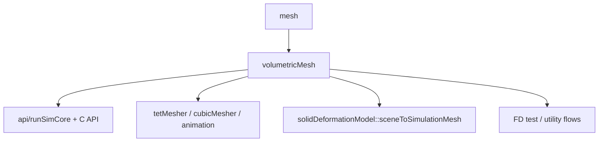
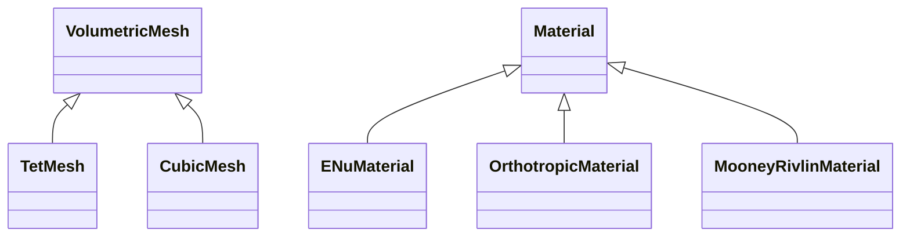

# volumetricMesh 模块详细重构计划

## 1. 模块上下文

### 1.1 在仓库中的角色

根据仓库根部的高层计划，`volumetricMesh` 是 `scene` 层中“体网格 + 材料 + 基础几何查询”的核心模块。它当前承担两类职责：

1. **场景表示**
   - 持有顶点、单元、材料、集合、区域
   - 提供 Tet / Cubic 两种体网格表示
2. **通用算法入口**
   - 读写 `.veg/.vegb`、部分特殊格式
   - 插值权重生成与应用
   - 表面提取
   - 质量矩阵生成
   - 子网格裁剪与顶点重编号

它在仓库中的位置不是单纯的“数据容器”，而是一个向上游工具层和下游能量层同时暴露能力的**基础设施模块**。

### 1.2 与高层计划的关系

根计划对该模块的判断基本准确，尤其是以下三点：

- `VolumetricMesh` 是上帝类
- `VolumetricMesh` 与 `SimulationMesh` 存在重复抽象
- 模块中仍残留大量 C 风格缓冲区 API 和旧式错误处理

本计划在此基础上进一步细化到目录/文件/类级别，目标不是“彻底重写”，而是给出一条**可以逐阶段落地、且不把下游一起炸掉**的重构路径。

### 1.3 外部依赖与下游调用面

**直接依赖：**

- `mesh`
- `EigenSupport` / `meshLinearAlgebra`
- `pgoLogging`
- `tbb`
- `stringHelper` / `fileIO` / 若干基础工具
- 可选 `Gmsh::Gmsh`

**重要下游：**

- `src/api/runSimCore.cpp`
- `src/api/c/pgo_c.cpp`
- `src/tools/cubicMesher/cubicMesher.cpp`
- `src/tools/tetMesher/*.cpp`
- `src/core/energy/solidDeformationModel/sceneToSimulationMesh.cpp`
- `src/core/energy/solidDeformationModel/deformationModelFDTest.cpp`
- `src/core/utils/animationIO/animationLoader.cpp`

这意味着该模块的重构必须优先锁定以下**切换面**，并在破坏式重构时同步修改它们：

- `TetMesh` / `CubicMesh` 构造与基本查询
- `io::save` / `io::load_*`
- `GenerateSurfaceMesh::computeMesh`
- `GenerateMassMatrix::computeMassMatrix`
- `SceneToSimulationMesh::fromTetMesh`

### 1.4 当前依赖关系图



---

## 2. 当前结构

### 2.1 文件分组

| 分组 | 文件 | 作用 |
|---|---|---|
| 抽象基类 | `volumetricMesh.h/.cpp` | 基础数据结构、材料/区域、公共几何查询、变换、子网格、材料编辑 |
| 具体网格 | `tetMesh.h/.cpp` | 四面体体网格实现 |
| 具体网格 | `cubicMesh.h/.cpp` | 立方体/voxel 网格实现 |
| 材料类型 | `volumetricMeshENuMaterial.*` | 各向同性 ENu 材料 |
| 材料类型 | `volumetricMeshOrthotropicMaterial.*` | 正交各向异性材料 |
| 材料类型 | `volumetricMeshMooneyRivlinMaterial.*` | Mooney-Rivlin 材料 |
| I/O | `volumetricMeshIO.*` | `.veg/.vegb` 读写、类型探测、二进制载入 |
| 文本解析 | `volumetricMeshParser.*` | 老式 `FILE*` 文本解析器，支持 `*INCLUDE` |
| 编辑 | `volumetricMeshEdit.*` | 子集裁剪、删除孤立顶点 |
| 导出 | `volumetricMeshExport.*` | 导出几何、`.ele/.node` |
| 插值 | `volumetricMeshInterpolation.*` | 生成/保存/读取插值权重、应用位移 |
| 算法 | `generateMassMatrix.*` | 组装质量矩阵、顶点质量 |
| 算法 | `generateSurfaceMesh.*` | 提取表面三角面/四边面 |
| 可选导入 | `loadMshFile.*` | Gmsh 输入 |
| 公共类型 | `volumetricMeshTypes.h` | `Geometry`、`InterpolationWeights`、元素类型别名 |

### 2.2 规模与热点

按行数看，当前真正的重构热点非常明确：

- `volumetricMeshIO.cpp`：1076 行
- `volumetricMesh.cpp`：824 行
- `cubicMesh.cpp`：782 行
- `tetMesh.cpp`：432 行
- `volumetricMesh.h`：390 行

这 5 个文件决定了模块的大部分复杂度。

### 2.3 类/结构体清单

| 名称 | 角色 | 评价 |
|---|---|---|
| `VolumetricMesh` | 抽象基类 + 数据拥有者 + 算法集合 | 过载，当前最大问题来源 |
| `VolumetricMesh::Set` | 元素集合 | 概念合理，但被嵌套在基类内，复用性差 |
| `VolumetricMesh::Material` | 材料抽象基类 | 概念合理，但嵌套 + RTTI/downcast 让耦合升高 |
| `VolumetricMesh::Region` | `set -> material` 映射 | 合理，但与 `elementMaterial` 存在双重表示 |
| `TetMesh` | 四面体实现 | 边界相对清楚，但仍混入特殊格式导入 |
| `CubicMesh` | 立方体实现 | 混入太多派生算法，职责明显超载 |
| `VolumetricMeshParser` | 文本格式解析器 | 应归入 `io::detail`，不应作为模块主接口的一部分 |
| `io::detail::LoadedMeshData` | 载入后的中间表示 | 非常有价值，适合作为未来解耦核心 |
| `Geometry` / `InterpolationWeights` | 值类型 | 方向是对的，但类型范围偏窄 |

### 2.4 当前类层次



这个层次本身并不复杂，复杂的是**过多非虚逻辑仍堆在 `VolumetricMesh` 与 `CubicMesh` 中**。

---

## 3. 责任分析

### 3.1 `VolumetricMesh` 的职责已经越界

`VolumetricMesh` 当前同时负责：

- 顶点/单元存储
- 材料、集合、区域的所有权与同步
- 元素到材料的映射缓存
- 质量、体积、惯性、重力等聚合算法
- 邻接/子集/重编号
- 线性扫描几何查询
- 插值入口
- 形变与线性变换
- 子网格构造
- 材料添加与裁剪规则

这不是单一职责违反一点点，而是**把 4 个子系统压成了一个类**：

1. `mesh storage`
2. `material domain model`
3. `mesh algorithms`
4. `public API facade`

### 3.2 `volumetricMeshIO.cpp` 是另一个上帝文件

它同时承担：

- ASCII 读取
- Binary 读取
- ASCII 写出
- Binary 写出
- mesh type 探测
- 文件格式探测
- material 反序列化
- region / set 反序列化
- `TetMesh` / `CubicMesh` 工厂入口

这导致两个后果：

- 任意 I/O 改动都要重新编译完整 I/O 单元
- I/O 代码必须直接依赖所有材料类型和具体网格类型，难以局部演进

### 3.3 `CubicMesh` 责任明显过重

`CubicMesh` 除了本该负责的立方体元素几何逻辑，还包含：

- 均匀网格工厂
- 数据插值
- 法向修正
- 梯度插值
- 细分
- parallelepiped 特殊模式

其中 `interpolateData`、`normalCorrection`、`subdivide` 都是**高层算法**，不该长期停留在具体网格类本体中。

### 3.4 `TetMesh` 也有重复职责

`TetMesh` 整体比 `CubicMesh` 干净，但仍有两个明显问题：

- 特殊 `.ele/.node` 导入构造函数把文件协议逻辑塞进了类型本体
- `assignFromData` 与 `CubicMesh::assignFromData` 基本平行重复

### 3.5 `Material / Set / Region` 的建模方式过于内嵌

当前数据模型同时保留了两种材料归属表达：

- `regions`：通过 set 到 material 的间接映射
- `elementMaterial`：每个元素的直接 material index

这不是绝对错误，但要求严格的同步策略。当前同步逻辑分散在：

- 构造函数
- `assignMaterialsToElements`
- `propagateRegionsToElements`
- `addMaterial`
- `subset_in_place`
- `subdivide`

这说明模型**缺少单一真相源**。

---

## 4. 耦合与内聚

### 4.1 模块内部耦合

#### 4.1.1 `editing` 通过 `friend` 直接穿透内部布局

`volumetricMeshEdit.cpp` 直接修改：

- `numElements`
- `elements`
- `elementMaterial`
- `sets`
- `vertices`
- `numVertices`

这使得 `VolumetricMesh` 无法自由改变内部布局。任何未来把 `elements` / `vertices` 包成独立对象的尝试，都会先被 `friend` 卡住。

#### 4.1.2 I/O 与材料类型强耦合

`volumetricMeshIO.cpp` 直接包含三种材料头文件，并在读取/写出时写死：

- ENu
- Orthotropic
- MooneyRivlin

这意味着新增材料类型时，I/O 必须修改；反过来，I/O 文件也掌握了全部材料协议细节。

#### 4.1.3 导出与元素类型分支散落

`generateSurfaceMesh.cpp`、`volumetricMeshExport.cpp`、`volumetricMeshIO.cpp` 等位置都在做：

- `if tet ...`
- `if cubic ...`
- `dynamic_cast`

元素类型知识没有统一收口。

### 4.2 模块外部耦合

#### 4.2.1 下游大量直接依赖具体类型

下游大多直接 include `tetMesh.h` / `cubicMesh.h`，而不是通过更窄的抽象接口：

- 仿真入口
- C API
- mesher 工具
- 动画加载器
- `sceneToSimulationMesh`

这决定了重构时不能只在模块内部偷偷改类型边界，而必须把下游调用点纳入同一批改动一起切换。

#### 4.2.2 `sceneToSimulationMesh` 依赖材料表示

`sceneToSimulationMesh.cpp` 直接依赖 `volumetricMeshENuMaterial.h` 并做 downcast。说明场景层材料表示已经泄漏到能量层转换逻辑。

### 4.3 内聚性评价

- `volumetricMeshEdit.*`：内聚还可以，但接口方式不对
- `volumetricMeshExport.*`：内聚较好
- `volumetricMeshInterpolation.*`：内聚较好
- `generateMassMatrix.*`：内聚较好
- `generateSurfaceMesh.*`：内聚较好，但缺少元素面枚举抽象
- `volumetricMesh.cpp` / `volumetricMeshIO.cpp` / `cubicMesh.cpp`：内聚差

---

## 5. 继承、组合与抽象边界

### 5.1 现有继承该保留什么

`VolumetricMesh <- TetMesh / CubicMesh` 这一层运行时多态仍有价值，至少当前不建议直接移除，因为：

- 下游已经广泛依赖该抽象
- Tet 与 Cubic 的几何核确实不同
- `getElementVolume / containsVertex / computeBarycentricWeights` 这类接口天然适合由具体元素实现

**结论：保留运行时多态，但缩小基类职责。**

### 5.2 应该从继承切换到组合的部分

以下部分不该继续作为 `VolumetricMesh` 的“内嵌所有物”存在：

1. **几何存储**
   - `vertices`
   - `elements`
   - `numVertices`
   - `numElements`
   - `numElementVertices`

2. **材料域模型**
   - `materials`
   - `sets`
   - `regions`
   - `elementMaterial`

3. **算法集合**
   - 邻接/子网格/变换/质量/查询/插值桥接

建议改为：

- `VolumetricMeshData`：纯数据拥有者
- `MaterialCatalog`：材料、set、region、一致性维护
- `VolumetricMeshAlgorithms`：对 `VolumetricMeshData` 的非成员算法
- `VolumetricMesh`：薄公共入口，聚合上述对象

### 5.3 不建议现在引入的高级范式

#### 5.3.1 不建议把 Tet/Cubic 改成 CRTP

当前收益不大，因为真正的问题不是虚函数开销，而是类边界错误。

#### 5.3.2 不建议在早期阶段立即把材料层次改成 `std::variant`

长期有价值，但在阶段 B/C 过早引入会波及：

- I/O
- `sceneToSimulationMesh`
- 下游材料 downcast 逻辑
- 所有复制/克隆路径

因此更合理的做法是：

- 先完成内部结构拆分与 I/O 收口
- 再把材料系统提升为独立阶段统一重构

也就是说，它不是“永远往后推”的项，而是不应该和早期结构拆分混在一起。

---

## 6. 设计模式建议

### 6.1 Thin Public Facade

`VolumetricMesh` / `TetMesh` / `CubicMesh` 可以继续作为公共类型名存在，但不再承担兼容旧接口的职责：

- `VolumetricMesh` 退化为薄公共入口
- 新接口直接替换旧接口
- 下游调用点在同一轮改动中同步切换

**为什么：** 你的目标不是兼容演进，而是尽快把错误边界改对。既然允许破坏式升级，就不应该为了旧接口继续背兼容债。

### 6.2 Reader / Writer Strategy

I/O 层建议拆成：

- `AsciiMeshReader`
- `BinaryMeshReader`
- `AsciiMeshWriter`
- `BinaryMeshWriter`
- `MeshFormatDetector`

**为什么：** 现在 `volumetricMeshIO.cpp` 把四种协议和工厂逻辑揉在一起，修改一个格式就得碰完整文件。

### 6.3 Factory / Builder

保留 `LoadedMeshData`，并让它成为创建具体网格对象的标准输入：

- `TetMesh::from_loaded_data`
- `CubicMesh::from_loaded_data`
- 或单独的 `MeshBuilder`

**为什么：** `LoadedMeshData` 已经是天然的中间层，应该从“临时 detail 结构体”升级为受控构建边界。

### 6.4 Domain Service

将 `addMaterial`、`propagateRegionsToElements`、`assignMaterialsToElements` 等逻辑收敛到一个专门服务中，例如：

- `RegionAssignment`
- `MaterialAssignmentService`

**为什么：** 当前这些逻辑散落在基类、编辑逻辑和细分逻辑里，任何修改都容易破坏不变量。

---

## 7. 目录重组建议

### 7.1 现状

```text
volumetricMesh/
├── volumetricMesh.h/.cpp
├── tetMesh.h/.cpp
├── cubicMesh.h/.cpp
├── volumetricMeshIO.h/.cpp
├── volumetricMeshParser.h/.cpp
├── volumetricMeshEdit.h/.cpp
├── volumetricMeshExport.h/.cpp
├── volumetricMeshInterpolation.h/.cpp
├── volumetricMeshENuMaterial.h/.cpp
├── volumetricMeshOrthotropicMaterial.h/.cpp
├── volumetricMeshMooneyRivlinMaterial.h/.cpp
├── generateMassMatrix.h/.cpp
├── generateSurfaceMesh.h/.cpp
└── loadMshFile.h/.cpp
```

### 7.2 目标结构

建议分成“核心数据 / 具体元素 / I/O / 算法 / 材料 / 公共入口”六层：

```text
volumetricMesh/
├── core/
│   ├── volumetric_mesh_data.hpp/.cpp
│   ├── material_catalog.hpp/.cpp
│   ├── region_assignment.hpp/.cpp
│   ├── mesh_queries.hpp/.cpp
│   ├── mesh_transform.hpp/.cpp
│   └── mesh_subset.hpp/.cpp
├── elements/
│   ├── tet_mesh.hpp/.cpp
│   ├── cubic_mesh.hpp/.cpp
│   ├── tet_mesh_ops.hpp/.cpp
│   └── cubic_mesh_ops.hpp/.cpp
├── materials/
│   ├── enu_material.hpp/.cpp
│   ├── orthotropic_material.hpp/.cpp
│   └── mooney_rivlin_material.hpp/.cpp
├── io/
│   ├── volumetric_mesh_io.hpp
│   ├── mesh_format_detector.cpp
│   ├── mesh_ascii_reader.cpp
│   ├── mesh_ascii_writer.cpp
│   ├── mesh_binary_reader.cpp
│   ├── mesh_binary_writer.cpp
│   ├── veg_parser.cpp
│   └── gmsh_loader.cpp
├── algorithms/
│   ├── interpolation_weights.hpp/.cpp
│   ├── mass_matrix_builder.hpp/.cpp
│   └── surface_mesh_builder.hpp/.cpp
└── public/
    ├── volumetric_mesh.hpp/.cpp
    ├── tet_mesh.hpp/.cpp
    └── cubic_mesh.hpp/.cpp
```

### 7.3 迁移策略

允许破坏式切换后，迁移策略应改成“按阶段切大块”，而不是维持双轨：

1. 先新增新目录与新实现
2. 同阶段直接替换模块内旧接口
3. 同阶段批量修改仓库内下游 include 与调用点
4. 完成一轮切换后再删除旧文件/旧符号，避免长期双轨

---

## 8. 具体重构步骤

下面的步骤按“先稳不变量、再拆内部、最后一次性切 API”的顺序安排。

### 阶段 A：先把不变量和切换边界固定住

1. **补充模块级回归测试骨架** `[M]` `[low-risk]`
   - 覆盖：ASCII/Binary round-trip、tet/cubic 体积、barycentric 权重、`subset_in_place`、`subdivide`、`GenerateSurfaceMesh`、`SceneToSimulationMesh::fromTetMesh`
   - 依赖：无
   - 为什么：没有这层保护，后面的内部拆分只能靠肉眼回归

2. **明确 `VolumetricMesh` 的不变量文档** `[S]` `[low-risk]`
   - 写清楚：
     - `elements.size() == numElements * numElementVertices`
     - `elementMaterial.size() == numElements`
     - `sets[0] == allElements`
     - `regions` 与 `elementMaterial` 的同步规则
   - 依赖：步骤 1
   - 为什么：当前不变量存在，但没有显式被定义

3. **定义破坏式切换边界，并列出需要同步修改的仓库内调用点** `[M]` `[low-risk]`
   - 明确哪些头文件、构造函数和工具入口会被直接替换
   - 把 `runSimCore`、C API、tools、`sceneToSimulationMesh` 纳入同一轮切换范围
   - 依赖：步骤 2
   - 为什么：既然不保兼容，就要避免出现“模块已切新接口、下游还在调用旧接口”的中间态

### 阶段 B：拆 `VolumetricMesh` 内部结构

4. **抽出 `VolumetricMeshData`，承接几何存储** `[L]` `[med-risk]`
   - 搬走：
     - `numVertices`
     - `vertices`
     - `numElementVertices`
     - `numElements`
     - `elements`
   - 直接让 `VolumetricMesh` 持有 `std::unique_ptr<VolumetricMeshData>`
   - 依赖：步骤 3
   - 为什么：这是降低 friend 和算法耦合的第一刀

5. **抽出 `MaterialCatalog` / `RegionAssignment`** `[L]` `[med-risk]`
   - 搬走：
     - `materials`
     - `sets`
     - `regions`
     - `elementMaterial`
     - `assignMaterialsToElements`
     - `propagateRegionsToElements`
     - `addMaterial`
     - `setSingleMaterial`
   - 依赖：步骤 4
   - 为什么：当前材料模型是第二个复杂度中心

6. **把 `subset_in_place` / `remove_isolated_vertices` 改成操作 data object，而非 friend 穿透** `[M]` `[med-risk]`
   - 方案优先级：
     - 优先：`MeshSubsetEditor(VolumetricMeshData&, MaterialCatalog&)`
     - 次选：`VolumetricMesh` 暴露受控 mutation hooks
   - 依赖：步骤 4、5
   - 为什么：只要 friend 还在，内部布局就不算真正可演化

7. **把通用算法从基类成员迁出为自由函数/服务对象** `[L]` `[med-risk]`
   - 迁出候选：
     - `getVolume`
     - `getMass`
     - `getInertiaParameters`
     - `getMeshGeometricParameters`
     - `computeGravity`
     - `applyDeformation`
     - `applyLinearTransformation`
     - 邻接/筛选/重编号逻辑
   - `VolumetricMesh` 的旧成员接口直接收敛到新的窄接口集合
   - 依赖：步骤 4、5
   - 为什么：让基类重新退化成“窄抽象 + 公共入口”

### 阶段 C：拆 I/O 单体

8. **把 `volumetricMeshIO.cpp` 拆成 reader / writer / detector / material serde** `[L]` `[med-risk]`
   - 最小拆法：
     - `mesh_ascii_reader.cpp`
     - `mesh_binary_reader.cpp`
     - `mesh_ascii_writer.cpp`
     - `mesh_binary_writer.cpp`
     - `mesh_format_detector.cpp`
     - `material_serde.cpp`
   - 依赖：步骤 5
   - 为什么：当前 I/O 单元太大，而且承担太多决策

9. **把 `VolumetricMeshParser` 下沉到 `io::detail`** `[M]` `[low-risk]`
   - 不再让 parser 作为模块公共一等头文件存在
   - 优先改名为 `veg_parser`
   - 依赖：步骤 8
   - 为什么：这是明显的实现细节，不该暴露在模块主命名空间入口

10. **移除 `TetMesh` 里的特殊格式解析构造逻辑，统一走 I/O 工厂** `[M]` `[med-risk]`
   - `.ele/.node` 导入放到 `io::load_tet_from_tetgen(...)`
   - 删除 `TetMesh(filename, specialFileType, verbose)` 这类协议感知构造函数
   - 依赖：步骤 8、9
   - 为什么：具体类型不应该理解文件协议

11. **把 `loadMshFile` 收进 `io/gmsh_loader`** `[S]` `[low-risk]`
   - 同步修改所有 Gmsh 入口调用点
   - 依赖：步骤 8
   - 为什么：Gmsh 是输入协议，不是网格域模型的一部分

### 阶段 D：清理 `TetMesh` / `CubicMesh`

12. **为 Tet/Cubic 引入独立 element ops 层** `[M]` `[med-risk]`
   - `tet_mesh_ops`：
     - volume
     - inertia
     - barycentric
     - gradient
     - closest-element distance
   - `cubic_mesh_ops`：
     - alpha/beta/gamma
     - barycentric
     - gradient
     - mass matrix
   - 依赖：步骤 7
   - 为什么：把元素几何核和对象生命周期分开

13. **把 `CubicMesh` 中的高层算法迁出** `[L]` `[med-risk]`
   - 迁出：
     - `interpolateData`
     - `normalCorrection`
     - `subdivide`
   - 目标：
     - `algorithms/cubic_mesh_interpolation`
     - `algorithms/cubic_mesh_normal_correction`
     - `algorithms/cubic_mesh_refinement`
   - 依赖：步骤 12
   - 为什么：`CubicMesh` 当前是该模块第二个过载类

14. **统一 `assignFromData` 路径，消除 Tet/Cubic 平行重复** `[M]` `[low-risk]`
   - 将公共检查与数据注入下沉到共享 helper
   - Tet/Cubic 仅保留 element-type 特定检查和自有派生字段初始化
   - 依赖：步骤 4、5、8、12
   - 为什么：减少平行维护成本

15. **为 `GenerateSurfaceMesh` 提供元素面枚举抽象** `[M]` `[med-risk]`
   - 目标不是去掉 runtime dispatch，而是统一“每个元素有哪些面、朝向如何定义”
   - 依赖：步骤 12
   - 为什么：当前 `generateSurfaceMesh.cpp` 里 tet/cubic 分支逻辑可维护性差

### 阶段 E：独立重构材料系统

16. **把材料模型从继承层次升级为值类型记录** `[L]` `[high-risk]`
   - 目标：
     - `MaterialKind`
     - `MaterialRecord`
     - `std::variant<EnuMaterialData, OrthotropicMaterialData, MooneyRivlinMaterialData>`
   - 不再让 `VolumetricMesh::Material` 成为长期公共主模型
   - 依赖：步骤 5、8、12
   - 为什么：材料模型现在仍然是 mesh 层之外最主要的耦合来源

17. **把 `MaterialCatalog` 全量切到值类型材料存储** `[L]` `[high-risk]`
   - 覆盖：
     - `materials`
     - `sets`
     - `regions`
     - `elementMaterial`
     - subset/subdivide 后的材料映射
   - 依赖：步骤 16
   - 为什么：只有 catalog 也切到新模型，材料系统重构才算完成

18. **让 `material_serde`、I/O 与材料值类型模型对齐** `[M]` `[med-risk]`
   - I/O 不再依赖旧材料继承层次和 downcast
   - 依赖：步骤 8、16、17
   - 为什么：否则 Phase C 的 I/O 拆分收益会被旧材料协议重新绑死

19. **把材料访问与下游适配收敛到统一入口** `[M]` `[med-risk]`
   - 新增：
     - `try_get_material<T>()`
     - `require_material<T>()`
     - `serialize_material(...)`
     - `deserialize_material(...)`
     - material adapter / visitor
   - 优先迁移：
     - `sceneToSimulationMesh`
   - 依赖：步骤 16、17、18
   - 为什么：为后续 API 现代化与下游切换建立稳定入口

### 阶段 F：移除 `VolumetricMesh` 基类，改成组合 + traits + mesh-agnostic / mesh-specific

20. **把 `ElementType`、`FileFormatType` 与 mesh 共有类型从 `VolumetricMesh` 中抽离** `[M]` `[low-risk]`
   - 新增独立公共类型头，例如：
     - `types/mesh_kind.h`
     - `types/file_format.h`
   - 不再让 `io`、tests、loader 为了拿枚举而 include `volumetricMesh.h`
   - 依赖：步骤 8、12、18
   - 为什么：这是删除 `volumetricMesh.h` 前最先要解除的“头文件反向中心化”

21. **引入组合式共享存储层，替代 `VolumetricMesh` 的数据拥有职责** `[L]` `[high-risk]`
   - 目标：
     - `MeshStorage`
     - `VolumetricMeshData`
     - `MaterialCatalog`
   - `TetMesh` / `CubicMesh` 改为直接持有共享存储，而不是继承基类获得：
     - geometry
     - materials
     - set / region
     - common transform/edit hooks
   - 依赖：步骤 4、5、17
   - 为什么：只要共享状态还藏在基类里，基类就删不掉

22. **建立 `mesh_traits` / `mesh_concepts`，把 element-specific 能力改成编译期分派** `[L]` `[high-risk]`
   - 新增：
     - `traits/mesh_traits.h`
     - `concepts/mesh_concepts.h`
   - 约束的能力至少包括：
     - `num_element_vertices`
     - `vertex_index`
     - `contains_vertex`
     - `compute_barycentric_weights`
     - `element_volume`
     - `element_mass_matrix`
   - Tet/Cubic 的差异继续落在：
     - `ops/tet_mesh_ops`
     - `ops/cubic_mesh_ops`
   - 依赖：步骤 12、13、21
   - 为什么：目标不是换一个新基类，而是把运行时多态真正收缩成编译期 traits + ops

23. **把 mesh-agnostic 内部模块从 `VolumetricMesh&` 改成模板 / concept 约束** `[L]` `[high-risk]`
   - 优先改造：
     - `internal/mesh_queries`
     - `internal/mesh_mass_properties`
     - `internal/mesh_transforms`
     - `algorithms/mesh_interpolation`
     - `algorithms/generate_mass_matrix`
   - 原则：
     - 通用流程模板化
     - element-specific 细节只走 traits / ops
   - 依赖：步骤 21、22
   - 为什么：这一步完成后，旧基类的大部分“只是转发”的价值就消失了

24. **把运行时分发收口到边界层，避免算法层继续依赖统一基类** `[L]` `[med-risk]`
   - 仅在真正需要运行时未知 mesh 类型的边界引入小型 sum type，例如：
     - `AnyMeshRef = std::variant<std::reference_wrapper<const TetMesh>, std::reference_wrapper<const CubicMesh>>`
   - 适用范围：
     - `generate_surface_mesh`
     - `mesh_save`
     - 少量工具层入口
   - 不允许把 `std::variant` 再包装成新的“大基类替代品”
   - 依赖：步骤 22、23
   - 为什么：运行时分发是边界需求，不应继续污染整个算法层

25. **重写 `TetMesh` / `CubicMesh` 对外结构，删除继承与虚函数转发** `[L]` `[high-risk]`
   - 删除：
     - `public VolumetricMesh`
     - `virtual getElementVolume / containsVertex / computeBarycentricWeights / computeElementMassMatrix / interpolateGradient`
   - 保留：
     - `TetMesh`
     - `CubicMesh`
     - 现有概念名字
   - 改为：
     - 组合共享 storage
     - 通过 traits / ops 提供 element-specific 行为
   - 依赖：步骤 21、22、23、24
   - 为什么：这是删除 `volumetricMesh.h/.cpp` 的前提条件，不应在前几步未完成时硬删

26. **迁移外部依赖面并最终删除 `volumetricMesh.h/.cpp`** `[L]` `[high-risk]`
   - 优先迁移：
     - `interpolationCoordinates/barycentricCoordinates`
     - `sceneToSimulationMesh`
     - `io/*`
     - `algorithms/*`
     - tools / C API / `runSimCore`
   - 完成条件：
     - 仓库内生产代码不再 include `volumetricMesh.h`
     - `volumetricMesh.cpp` 不再有唯一行为，只剩空壳
     - 删除旧基类文件，不保留兼容转发头
   - 依赖：步骤 20~25
   - 为什么：你要的不是“保留一个更薄的上帝类”，而是彻底移除这个错误的中心抽象

### 阶段 G：现代化 API，并直接切换

27. **为原始缓冲区接口补 `std::span` 重载** `[M]` `[med-risk]`
   - 优先补：
     - `getElementVertices`
     - `getElementEdges`
     - `computeBarycentricWeights`
     - `computeElementMassMatrix`
     - `getVertexVolumes`
     - `computeGravity`
   - 仓库内调用点直接切换到 `std::span` 版本
   - 依赖：步骤 23、25
   - 为什么：当基类删掉以后，这批接口更适合直接以轻量 view 形式重建

28. **为查询接口增加 typed result** `[M]` `[med-risk]`
   - 新增：
     - `std::optional<int> find_containing_element(...)`
     - `Expected<void, IoError>` 或内部错误对象
   - 删除：
     - `getContainingElement()` 返回 `-1` 的旧语义
     - `io::save()` 返回 `int` 的旧语义
   - 依赖：步骤 20、23、27
   - 为什么：既然允许破坏式升级，就应直接把错误表达方式改掉

### 阶段 H：下游迁移与收口

29. **优先迁移 `sceneToSimulationMesh` 到新接口层** `[M]` `[med-risk]`
   - 让它依赖“只读 tet mesh view + 值类型材料适配层”，而不是旧的宽头文件集合
   - 依赖：步骤 19、25、27、28
   - 为什么：这是 `volumetricMesh -> solidDeformationModel` 的关键桥

30. **同步迁移 API/工具层 include 与调用点到新路径/新接口** `[L]` `[med-risk]`
   - 顺序：
     - 工具层
     - 动画层
     - C API
     - `runSimCore`
   - 依赖：步骤 20~29
   - 为什么：外层收口必须和接口切换同时完成，避免仓库进入“新旧 mesh 抽象双轨”

---

## 9. API 迁移说明

### 9.1 切换原则

本计划假定**允许不兼容旧 API**。因此目标不是维持旧签名，而是一次性把仓库内调用点切到新的公共接口上。

可以继续保留的主要是**概念名字**，不是旧函数签名：

- `TetMesh`
- `CubicMesh`
- `io`
- `GenerateMassMatrix`
- `GenerateSurfaceMesh`

其中 `VolumetricMesh` 不再被视为必须保留的公共中心类型；如果 Phase F 完成，应允许它彻底消失。

### 9.2 建议直接替换的 API

| 旧 API | 新 API | 迁移方式 |
|---|---|---|
| `getContainingElement(Vec3d)` -> `-1` | `find_containing_element(Vec3d)` -> `std::optional<int>` | 直接替换并同步修改调用点 |
| `void getElementVertices(..., Vec3d*)` | `std::span<Vec3d>` 版本 | 直接替换 |
| `void getElementEdges(..., int*)` | `std::span<int>` 版本 | 直接替换 |
| `int io::save(...)` | `expected<void, IoError>` 或异常版内部实现 | 直接替换错误处理语义 |
| `Material*` / `downcast*Material()` | `MaterialRecord` + `try_get_material<T>()` / `require_material<T>()` / visitor | 在独立材料阶段完成切换 |

### 9.3 构造路径迁移

建议最终收敛为：

- 文件输入统一走 `io::*`
- 类型构造只接受内存数据或已验证的 `LoadedMeshData`

也就是：

- `TetMesh(filename)` / `CubicMesh(filename)` 若继续存在，也应只是清晰的文件加载入口
- `TetMesh(filename, specialFileType, ...)` 这类协议感知构造函数应直接删除

---

## 10. 风险评估

### 10.1 高风险点

1. **`regions / sets / elementMaterial` 同步逻辑**
   - 任何抽取或重排都可能导致材料指派错误

2. **`CubicMesh::subdivide`**
   - 会同时改顶点、单元、set、material 映射

3. **I/O round-trip**
   - 旧 `.veg/.vegb` 是对外协议，不能在重构中意外改格式

4. **材料系统值类型化**
   - 会同时波及 catalog、I/O、subset/subdivide、复制/克隆和下游材料访问

5. **`sceneToSimulationMesh`**
   - 它对 Tet 材料和网格布局有隐式假设

### 10.2 中风险点

1. **`subset_in_place` / `remove_isolated_vertices`**
   - 当前靠 friend 穿透，迁出后最容易出现索引失配

2. **`GenerateSurfaceMesh` 的方向一致性**
   - 表面朝向和面去重逻辑一旦出错，下游显示和接触都会受影响

3. **`getClosestElement` 行为**
   - Tet 和基类实现标准不同，迁移时要确保语义不退化

### 10.3 建议测试矩阵

至少补以下测试：

- Tet/Cubic 构造、clone、subset、renumber
- `setSingleMaterial` / `addMaterial` / `propagateRegionsToElements`
- `.veg` round-trip
- `.vegb` round-trip
- Tet barycentric / contains / gradient
- Cubic barycentric / contains / gradient
- `GenerateMassMatrix`
- `GenerateSurfaceMesh`
- `SceneToSimulationMesh::fromTetMesh`
- `C API` 的 `create/save/update_vertices` 最小回归

---

## 11. 风格规范收敛

### 11.1 当前主要不符合项

| 项目 | 当前情况 | 建议 |
|---|---|---|
| 文件名 | `volumetricMesh.h`、`tetMesh.h` | 新文件统一 snake_case |
| 函数名 | 旧成员多为 camelCase | 新增 API 一律 snake_case |
| 成员变量 | 无统一 `m_` 前缀 | 新增类按目标规范执行 |
| 头文件暴露 | parser/detail 类型暴露过多 | detail 下沉，减少 public surface |

### 11.2 建议的重命名目标

| 现名 | 目标名 |
|---|---|
| `volumetricMesh.h/.cpp` | `volumetric_mesh.hpp/.cpp` |
| `tetMesh.h/.cpp` | `tet_mesh.hpp/.cpp` |
| `cubicMesh.h/.cpp` | `cubic_mesh.hpp/.cpp` |
| `volumetricMeshIO.h/.cpp` | `volumetric_mesh_io.hpp/.cpp` |
| `volumetricMeshEdit.h/.cpp` | `volumetric_mesh_edit.hpp/.cpp` |
| `volumetricMeshExport.h/.cpp` | `volumetric_mesh_export.hpp/.cpp` |
| `volumetricMeshInterpolation.h/.cpp` | `volumetric_mesh_interpolation.hpp/.cpp` |
| `volumetricMeshParser.h/.cpp` | `veg_parser.hpp/.cpp` |
| `generateMassMatrix.h/.cpp` | `mass_matrix_builder.hpp/.cpp` |
| `generateSurfaceMesh.h/.cpp` | `surface_mesh_builder.hpp/.cpp` |

### 11.3 实施原则

- 不要在第一阶段批量改名
- 但在进入某一阶段后，应直接完成该阶段涉及文件的重命名和引用修复
- 不要为了旧名字保留长期转发层

---

## 12. 推荐执行顺序

如果你准备真正开始动这个模块，我建议按下面顺序做：

1. 补测试与不变量文档
2. 抽 `VolumetricMeshData`
3. 抽 `MaterialCatalog / RegionAssignment`
4. 干掉 `editing` 的 friend 穿透
5. 拆 `volumetricMeshIO.cpp`
6. 抽 `Tet/Cubic` 的 element ops
7. 把 `CubicMesh` 高层算法迁出
8. 独立重构材料系统，并切到值类型模型
9. 抽离 mesh 公共类型与共享 storage
10. 引入 `mesh_traits` / `mesh_concepts`
11. 把通用算法改成 mesh-agnostic 模板
12. 收口边界层运行时分发
13. 重写 `TetMesh` / `CubicMesh` 的继承结构
14. 删除 `volumetricMesh.h/.cpp`
15. 最后再做 `std::span` / `optional` 现代化和工具/API 全仓切换

---

## 13. 总结

这个模块真正的问题不是“老代码风格不统一”，而是**域模型、几何算法、文件协议和公共 API 入口仍然被压在同一个层次里**。其中最值得立即处理的三块是：

1. `VolumetricMesh` 内部数据与算法未分离
2. `volumetricMeshIO.cpp` 过于集中，已经成为第二个上帝单元
3. `CubicMesh` 里混入了太多本应属于算法层的逻辑

因此，本模块的正确重构方向不是继续把 `VolumetricMesh` 磨得更薄，而是：

- 先抽数据与材料模型
- 再拆 I/O 与算法
- 再把 mesh-specific 行为下沉到 `traits + ops`
- 最后删除 `VolumetricMesh` 这个错误的中心抽象，并一次性迁完下游

这样做的结果是：`TetMesh` / `CubicMesh` 会变成组合式类型，算法层将形成真正的 `mesh-agnostic + mesh-specific implementation` 结构，而不是继续围着一个历史基类转发。
